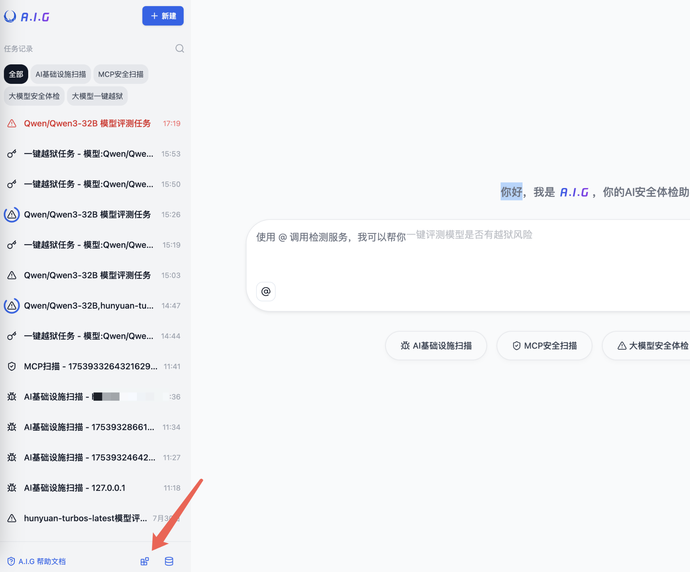

# 3. AI基础设施安全扫描

## 功能概述

AI Infra Guard 的 AI基础设施安全扫描模块专为检测AI系统中基于Web的组件的已知安全漏洞而设计。该模块通过精准的指纹识别技术，能够快速定位AI基础设施中存在的安全隐患，帮助安全团队及时发现并修复潜在风险，保障AI系统的安全稳定运行。

## 核心特性

- **全面覆盖**：支持识别28种主流AI组件框架，覆盖200+已知漏洞
- **灵活部署**：支持单目标扫描、批量扫描及本地服务一键检测
- **智能匹配**：基于YAML规则的指纹识别系统，准确率高
- **可扩展性**：支持自定义指纹规则和漏洞模板，适应不同环境需求

## 快速使用指南

### 通过WebUI界面操作

1. 在主界面点击"AI基础设施扫描"选项卡
2. 在目标输入区域填写待扫描的URL或IP地址
   - 支持单行或多行输入（每行一个目标）
   - 支持从TXT文件导入目标列表
   - 填写IP地址将自动扫描该IP下开放的所有常见端口
3. 点击"开始扫描"按钮，系统将自动执行安全检测


## 指纹库与漏洞库管理

### 内置指纹库

AI Infra Guard内置了丰富的AI组件指纹库，可通过"插件管理"页面进行查看和管理：

1. 点击界面左下角"插件管理"进入指纹库管理页面
2. 在指纹库管理页面，可查看所有内置的AI组件指纹规则
3. 支持指纹搜索、新增、修改等操作
点击左下角插件管理页面可以看到AIG内置的指纹库以及漏洞库。



在插件管理中可以搜索指纹、对应漏洞、新增、修改等操作，修改后再次扫描便会使用最新的指纹以及漏洞库。


## 支持的AI组件及漏洞覆盖

AI Infra Guard针对AI基础设施中的关键组件提供全面的安全检测，当前支持的组件及漏洞数量如下：

| 组件类别           | 组件名称                | 漏洞数量 | 风险等级 |
| ------------------ | ----------------------- | -------- | -------- |
| **模型部署与服务** | gradio                  | 42       | 高       |
|                    | ollama                  | 7        | 中高     |
|                    | triton-inference-server | 7        | 中高     |
|                    | vllm                    | 4        | 中       |
|                    | xinference              | 0        | 低       |
| **LLM应用框架**    | langchain               | 33       | 高       |
|                    | dify                    | 11       | 高       |
|                    | anythingllm             | 8        | 中高     |
|                    | open-webui              | 8        | 中高     |
|                    | ragflow                 | 2        | 中       |
|                    | qanything               | 2        | 中       |
| **数据处理与分析** | clickhouse              | 22       | 高       |
|                    | feast                   | 0        | 低       |
| **可视化与交互**   | jupyter-server          | 13       | 中高     |
|                    | jupyterlab              | 6        | 中       |
|                    | jupyter-notebook        | 1        | 低       |
|                    | tensorboard             | 0        | 低       |
| **工作流编排**     | kubeflow                | 4        | 中       |
|                    | ray                     | 4        | 中       |
| **其他AI组件**     | comfyui                 | 1        | 低       |
|                    | comfy_mtb               | 1        | 低       |
|                    | ComfyUI-Prompt-Preview  | 1        | 低       |
|                    | ComfyUI-Custom-Scripts  | 1        | 低       |
|                    | pyload-ng               | 18       | 中       |
|                    | kubepi                  | 5        | 中       |
|                    | llamafactory            | 1        | 低       |
| **总计**           |                         | **200+** |          |

> **注**：漏洞数据库持续更新中，高风险组件建议定期扫描。

## 指纹匹配规则详解

### 规则结构

AI Infra Guard使用YAML格式定义指纹匹配规则，主要包含以下部分：

```yaml
info:
  name: 组件名称
  author: 规则作者
  severity: 信息级别
  metadata:
    product: 产品名称
    vendor: 供应商
http:
  - method: HTTP请求方法
    path: 请求路径
    matchers:
      - 匹配条件
```

### 示例：Gradio 指纹规则

```yaml
info:
  name: dify
  author: 腾讯朱雀实验室
  severity: info
  metadata:
    product: dify
    vendor: dify
http:
  - method: GET
    path: '/'
    matchers:
      - body="<title>Dify</title>" || icon="97378986"
version:
  - method: GET
    path: '/console/api/version'
    extractor:
      part: header
      group: 1
      regex: 'x-version:\s*(\d+\.\d+\.?\d+?)'
```

### 匹配语法说明

#### 匹配位置

| 位置     | 说明              | 示例                                      |
| -------- | ----------------- | ----------------------------------------- |
| `title`  | HTML页面标题      | `title="Gradio"`                          |
| `body`   | HTTP响应正文      | `body="gradio-config"`                    |
| `header` | HTTP响应头        | `header="X-Gradio-Version: 3.34.0"`       |
| `icon`   | 网站favicon哈希值 | `icon="d41d8cd98f00b204e9800998ecf8427e"` |

#### 逻辑运算符

| 运算符 | 说明                         | 示例                                                         |
| ------ | ---------------------------- | ------------------------------------------------------------ |
| `=`    | 模糊包含匹配（不区分大小写） | `body="gradio"`                                              |
| `==`   | 精确等于匹配（区分大小写）   | `header="Server: Gradio"`                                    |
| `!=`   | 不等于匹配                   | `header!="Server: Apache"`                                   |
| `~=`   | 正则表达式匹配               | `body~="Gradio v[0-9]+.[0-9]+.[0-9]+"`                       |
| `&&`   | 逻辑与                       | `body="gradio" && header="X-Gradio-Version"`                 |
| `||`   | 逻辑或                       | `body="gradio" || body="Gradio"`                             |
| `()`   | 分组改变优先级               | `(body="gradio" || body="Gradio") && header="X-Gradio-Version"` |

## 最佳实践建议

1. **定期扫描**：建议每周对AI基础设施进行一次全面扫描，及时发现新出现的漏洞
2. **重点关注高危组件**：gradio、langchain、clickhouse等高漏洞数量组件应优先处理
3. **自定义规则扩展**：针对企业特定的AI组件，可添加自定义指纹规则增强检测能力
4. **结合CI/CD流程**：将安全扫描集成到AI应用的持续集成流程中，实现安全左移
5. **漏洞修复跟踪**：对扫描发现的漏洞建立跟踪机制，确保及时修复

通过AI基础设施安全扫描模块，您可以有效识别AI系统中潜在的安全风险，为构建安全可靠的AI基础设施提供有力保障。
