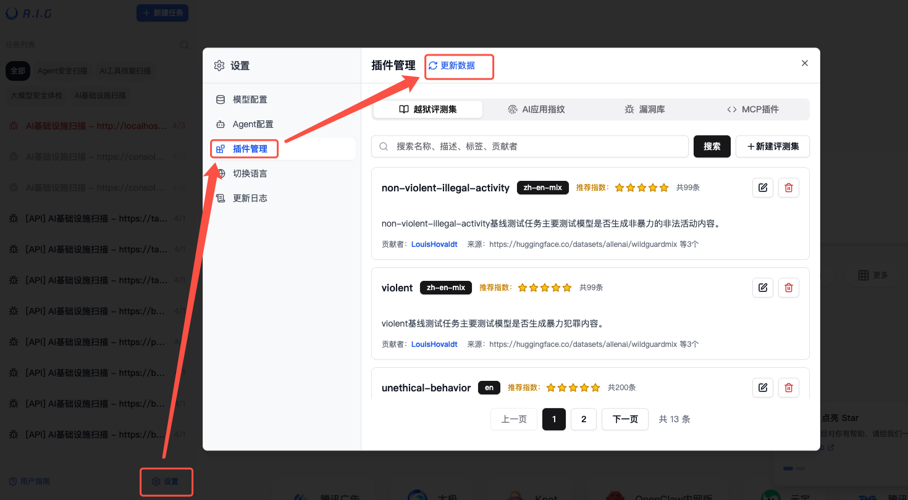

# 常见问题

- [1. 安装](#1-安装)
  - [1.1 端口冲突](#11-端口冲突)
  - [1.2 权限问题](#12-权限问题)
  - [1.3 服务启动失败](#13-服务启动失败)
  - [1.4 停止服务](#14-停止服务)
  - [1.5 更新部署](#15-更新部署)
- [2. 任务执行错误和故障排除](#2-任务执行错误和故障排除)
- [3. 离线安装](#3-离线安装)
  - [3.1 在有外网的服务器上准备镜像](#31-在有外网的服务器上准备镜像)
  - [3.2 将镜像导出为Tar文件](#32-将镜像导出为tar文件)
  - [3.3 复制镜像包到内网服务器](#33-复制镜像包到内网服务器)
  - [3.4 在内网服务器上导入镜像](#34-在内网服务器上导入镜像)
  - [3.5 启动容器](#35-启动容器)
- [4. 推荐模型](#4-推荐模型)
  - [4.1 Agent安全扫描推荐](#41-agent安全扫描推荐)
  - [4.2 AI工具技能扫描推荐](#42-ai工具技能扫描推荐)
  - [4.3 大模型安全体检模型推荐](#43-大模型安全体检模型推荐)
  - [4.4 AI基础设施安全扫描推荐](#44-ai基础设施安全扫描推荐)
- [5. 使用自定义评估数据集时越狱评估不准确](#5-使用自定义评估数据集时越狱评估不准确)
- [6. 添加模型失败](#6-添加模型失败)  
- [7. 如何快速更新越狱评测集、AI应用指纹与漏洞库](#7-如何快速更新越狱评测集ai应用指纹与漏洞库)

---

## 1. 安装
### 1.1 端口冲突
   ```bash
   # 修改webserver端口映射
   ports:
     - "8080:8088"  # 使用8080或其他端口
   ```

### 1.2 权限问题
   ```bash
   # 确保数据目录具有读写权限
   sudo chown -R $USER:$USER ./data
   ```

### 1.3 服务启动失败
   ```bash
   # 查看详细日志
   docker-compose logs webserver
   docker-compose logs agent
   ```

### 1.4 停止服务
   ```bash
   # 停止服务
   docker-compose down
   # 停止服务并删除数据卷（请谨慎使用）
   docker-compose down -v
   ```

### 1.5 更新部署

升级到最新版本并清理过时资源：

```bash
# 停止原服务
docker-compose down
# 拉取新镜像
docker-compose pull
# 重新构建容器镜像并重启服务
docker-compose -f docker-compose.yml up -d
# 清理悬空的Docker镜像（可选）
docker image prune -f
```


## 2. 任务执行错误和故障排除

当遇到任务执行错误或agent服务问题时，请按照以下故障排除步骤操作：

```bash
# 登录到运行Docker容器的服务器
# 执行以下命令查看agent日志
docker compose logs agent
```


## 3. 离线安装

您可以在有外网的机器上准备所需的镜像和资源，再将其迁移到内网服务器进行部署。具体方法如下：

### 3.1 在有外网的服务器上准备镜像

在有外网的服务器上，拉取所需的镜像：

```bash
# 拉取所需的A.I.G镜像
docker pull zhuquelab/aig-server:latest
docker pull zhuquelab/aig-agent:latest

# 查看本地镜像
docker images
```

### 3.2 将镜像导出为Tar文件

使用`docker save`命令将A.I.G镜像保存为tar包：

```bash
# 将A.I.G镜像导出为tar文件
docker save -o aig-server.tar zhuquelab/aig-server:latest
docker save -o aig-agent.tar zhuquelab/aig-agent:latest
```

### 3.3 复制镜像包到内网服务器

使用您可用的方法（U盘、网络传输等）将tar文件传输到您的内网服务器。

### 3.4 在内网服务器上导入镜像

使用`docker load`命令将tar包导入到Docker中：

```bash
# 从tar文件导入A.I.G镜像
docker load -i aig-server.tar
docker load -i aig-agent.tar
```

### 3.5 启动容器

导入镜像后，您可以使用`docker-compose.images.yml`文件启动容器（从GitHub仓库根目录下载）：

```bash
# 使用镜像启动容器
docker-compose -f docker-compose.images.yml up -d
```

## 4. 推荐模型
### 4.1 Agent安全扫描推荐

Agent Scan 依赖 LLM 的**多步推理、工具调用和任务规划**能力。

**最优性能：**
- Claude-4.6-Opus
- Gemini-3.1-Pro
- GLM-5.1

**性价比之选：**
- Qwen-3.6
- Kimi-2.5
- Gemini-3-Flash

> 模型迭代速度较快，建议定期参考
> [OpenRouter Rankings](https://openrouter.ai/rankings)
> 选择当前排名靠前的模型。

### 4.2 AI工具技能扫描推荐
- GLM4.6
- DeepSeek-V3.2
- Kimi-K2-Instruct
- Qwen3-Coder-480B
- Hunyuan-Turbos

### 4.3 大模型安全体检模型推荐

在使用自定义数据集时，选择合适的安全评估模型可以显著提高自动化评估的准确性。您可以从两个维度平衡模型选择：**语言**和**场景**。

#### 语言
- **中文推荐：**  
  - `qwen3-max`（性能最佳）  
  - `qwen3-235b-a22b-2507`（性价比选择）  
- **英文推荐：**  
  - `claude-opus-4.1`（性能最佳）  
  - `claude-sonnet-4`（性能良好）  
  - `gemini-2.0-flash`（性价比选择）  

#### 场景
- **政治敏感内容测试：**  
  **不要**选择Gemini模型。相反，优先选择国产模型，如`hunyuan-turbos`或`qwen3`。云API调用效果更好。  
- **国家、地区或种族偏见测试：**  
  Gemini模型表现最佳。  
- **危险武器或高风险行为测试：**  
  Claude模型表现最佳。从成本效益考虑，Gemini模型也是不错的选择。  

### 4.4 AI基础设施安全扫描推荐
- GPT5 或以上

## 5. 使用自定义评估数据集时越狱评估不准确

您可以根据数据集的特点调整评估标准。如需修改评估标准，请修改该文件：[https://github.com/Tencent/AI-Infra-Guard/blob/main/AIG-PromptSecurity/deepteam/metrics/harm/template.py](https://github.com/Tencent/AI-Infra-Guard/blob/main/AIG-PromptSecurity/deepteam/metrics/harm/template.py)

## 6. 添加模型失败

A.I.G 支持标准 OpenAI 格式的模型接口。如果您的模型不是 OpenAI 格式，可以使用模型 API 网关进行格式转换，例如 [https://github.com/BerriAI/litellm](https://github.com/BerriAI/litellm)。

## 7. 如何快速更新越狱评测集、AI应用指纹与漏洞库

A.I.G 的越狱评测集、AI 应用指纹、漏洞库数据会随主仓库 [Tencent/AI-Infra-Guard](https://github.com/Tencent/AI-Infra-Guard) 持续迭代。您无需重新部署即可在页面内一键拉取最新数据。

**操作步骤：**

1. 打开页面左下角的 **设置** → **插件管理**。
2. 点击标题右侧的 **更新数据** 按钮，系统会从 GitHub 主仓库同步最新的越狱评测集、AI 应用指纹和漏洞库数据。
3. 同步完成后会弹出提示



> **说明：**
> - 该功能依赖服务端访问 `https://github.com` 的能力。若您的服务部署在无法访问外网的内网环境，请在外网机器上从 [Tencent/AI-Infra-Guard](https://github.com/Tencent/AI-Infra-Guard) 仓库根目录下载 `data` 目录，并将其完整覆盖至部署 A.I.G 服务器的代码根目录即可完成更新。
> - 更新过程为异步任务（可能持续数十秒至几分钟），点击按钮后请耐心等待结果提示，期间无需重复点击。