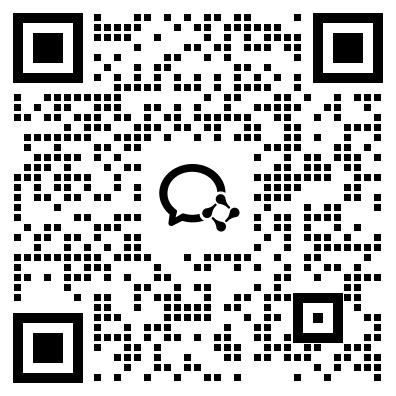

**A.I.G (AI-Infra-Guard)** is an open-source AI Red Teaming platform designed to provide a
comprehensive security view of your entire AI stack developed by Tencent Zhuque Lab.

## Core Features

- **AI Infra Scan**:
  Identifies known CVE vulnerabilities in web services of AI frameworks and components (e.g., Ollama,  ComfyUI) used across AI training, deployment, and application development through precise fingerprint matching.

- **MCP Scan**:
  Leverages AI Agents to intelligently detect security threats in MCP Servers — including tool poisoning, code vulnerabilities, and data exfiltration risks — enabling MCP developers and marketplaces to complete security certification prior to release.

- **Jailbreak Evaluation**:
  Uses high-quality, diverse datasets to automatically evaluate LLM resilience against malicious, adversarial, or deceptive prompts, exporting vulnerable cases to support model security alignment and guardrail reinforcement.

## Contributing
We invite security community and developers worldwide to join us in building the industry's leading AI red teaming security platform  together.
A.I.G is now open-source on [Github](https://github.com/Tencent/AI-Infra-Guard) .   Through its plugin system, it enables rapid configuration of:

-  AI component fingerprints
-  CVE vulnerability signatures
-  Jailbreak evaluation datasets
-  MCP security scanning plugins

## Contact Us
Help us make A.I.G better.  Report bugs, suggest improvements, and contribute to enhancing its detection capabilities.  Join the community discussion group  to share your findings and collaborate with others.

    

