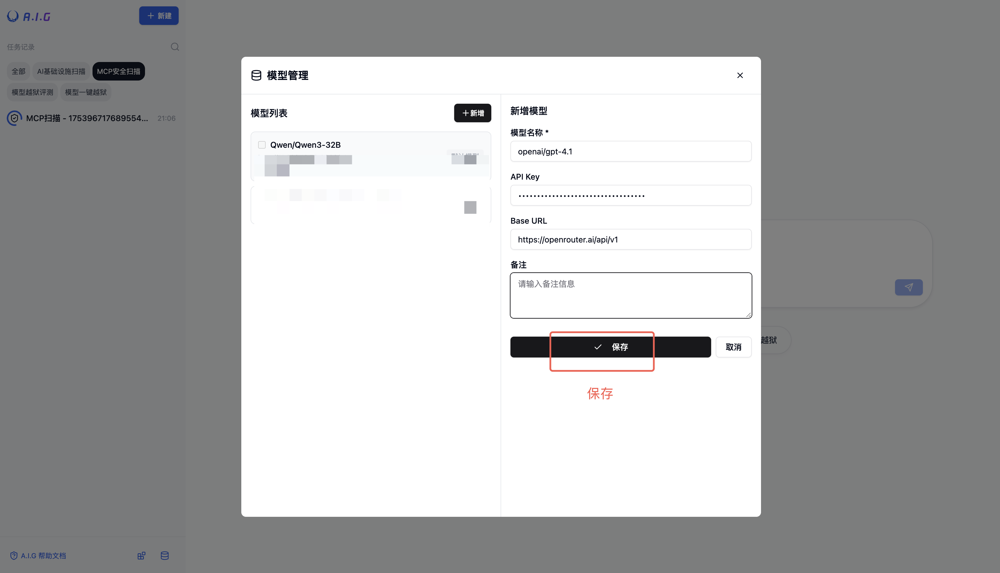
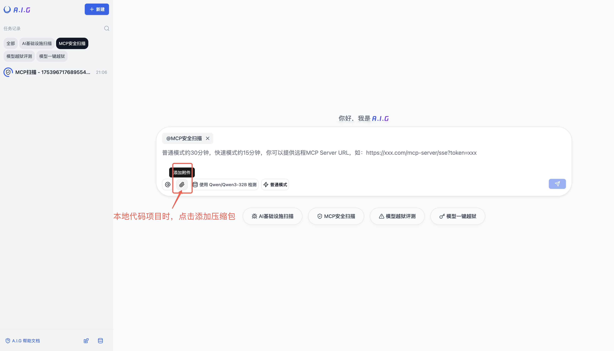
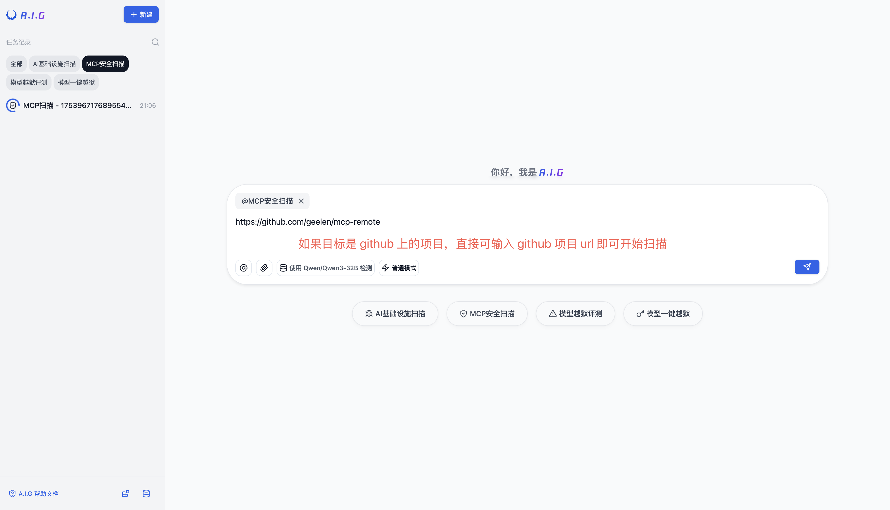
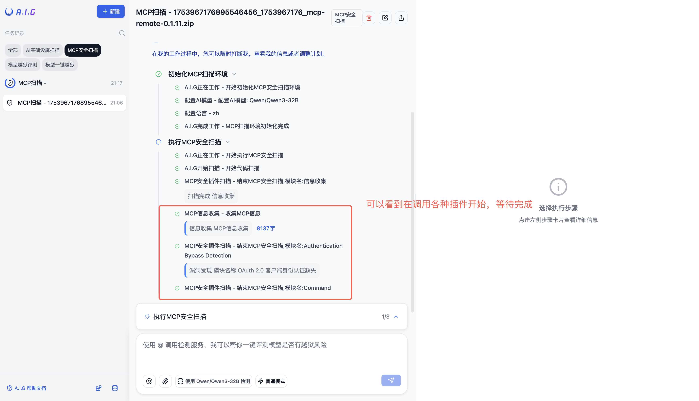
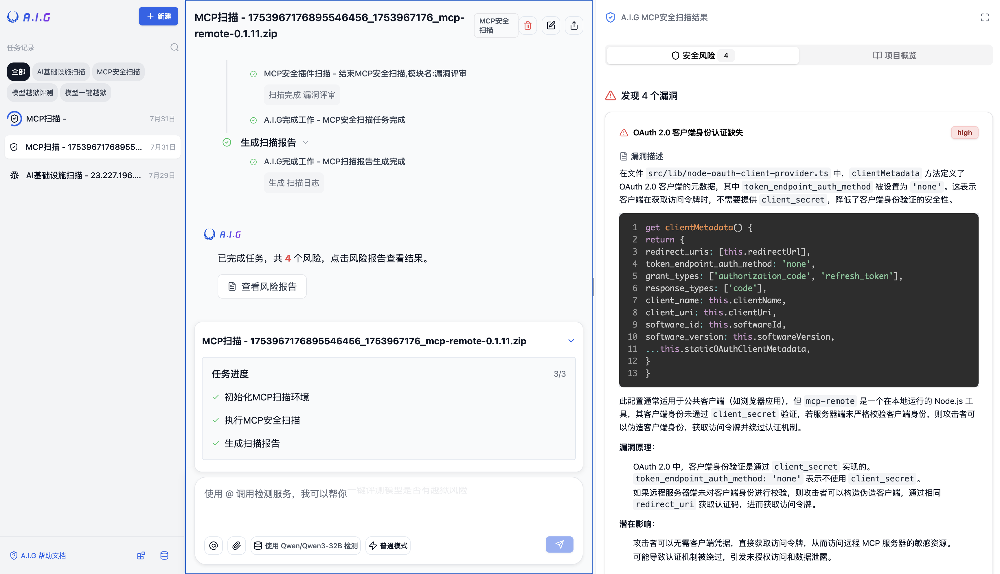
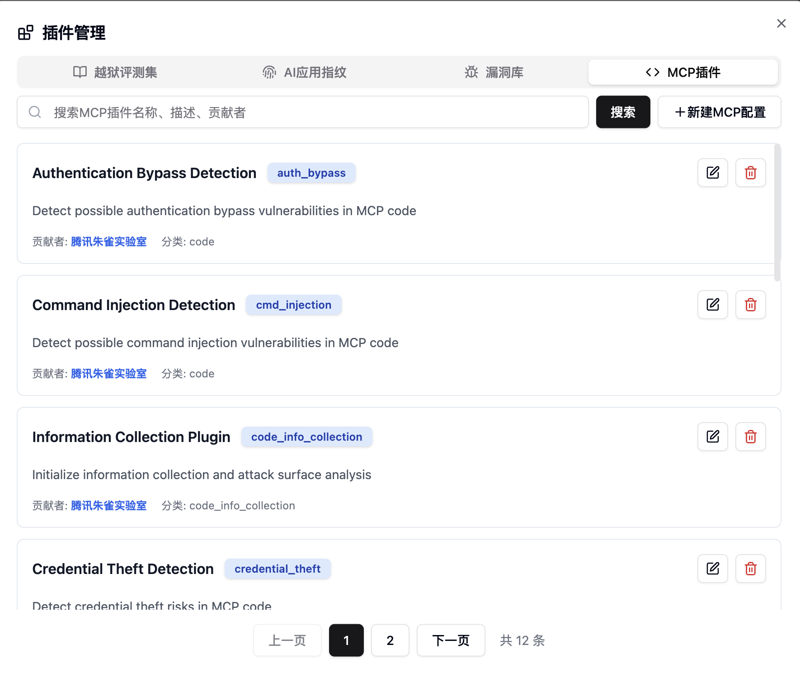

# 4. MCP安全扫描

A.I.G使用了基于AI Agent驱动的MCP Server检测方案，支持MCP Server源代码安全审计与远程MCP Server URL安全扫描。


AI Infra Guard 可检测以下常见的MCP安全风险，并持续更新：

| 风险名称             | 风险说明                                                                                                                                                                                                 |
|----------------------|---------------------------------------------------------------------------------------------------------------------------------------------------------------------------------------------------------|
| 工具投毒攻击         | 恶意MCP Server通过工具描述注入隐藏指令，操纵AI Agent执行未授权操作（例如窃取数据、执行恶意行为）。                                                                                                           |
| 地毯式骗局           | 恶意MCP Server在初期表现正常，但在用户批准或运行若干次后改变行为，执行恶意指令，导致难以察觉的恶意行为。                                                                                                     |
| 工具覆盖攻击         | 恶意MCP Server通过隐藏指令重新定义其他可信MCP Server工具的行为（例如修改邮件接收者、执行额外操作）。                                                                                                         |
| 恶意代码/命令执行    | MCP Server若支持直接执行代码或命令且缺乏沙箱隔离，可能被攻击者利用在服务器或用户本地执行恶意操作。                                                                                                       |
| 数据窃取             | 恶意MCP Server诱导AI Agent读取并传输敏感数据（例如API密钥、SSH密钥），或直接将用户授权输入的数据发送至外部服务器。                                                                                             |
| 未授权访问/鉴权不当  | MCP Server缺乏有效授权认证或存在缺陷，导致攻击者可绕过验证访问受限资源或用户数据。                                                                                                                       |
| 间接提示词注入       | MCP Server将包含恶意指令的外部数据（例如网页、文档）输出给AI Agent，可能影响AI Agent的决策和行为。                                                                                                               |
| 包名混淆与抢注攻击   | 恶意MCP Server使用与可信服务相似的名称、工具名或描述，诱导AI Agent错误调用；或第三方抢注官方MCP Server名称，植入后门。                                                                                       |
| 明文存储密钥         | MCP Server在代码或配置文件中硬编码或明文存储敏感密钥，易导致泄露风险。                                                                                                                                 |

## a) MCP服务源代码扫描
A.I.G的MCP Server扫描能力完全由Agent驱动，检测准确性与时长取决于用户选择的大模型API。

### 添加用检测MCP的模型API




### 上传MCP Server源代码附件

1. 选择“MCP安全扫描”
2. 添加附件上传MCP代码

3. 开始扫描


### 输入MCP项目Github扫描
1. 选择“MCP安全扫描”

2. 输入框输入GitHub地址
3. 开始扫描

## b) 远程MCP服务扫描

1. 选择“MCP安全扫描”
2. 输入框输入MCP服务地址 (SSE或Streamable HTTP协议)，如：https://mcp.deepwiki.com/mcp
3. 开始扫描

### 查看扫描状态和结果



## 推荐使用的大模型API
1. qwen3 32B
2. qwen3-coder
3. deepseek v3
4. claude-4-sonnet
5. gpt-4.1
6. gemini-2.5-pro
7. hunyuan-turbos

## MCP 插件

MCP扫描基于AI Agent对代码进行检测，AIG将MCP漏洞抽象为了插件，可以在前端查看或编辑。



MCP插件模板如下，关键的是`prompt_template`字段，用提示词告诉大模型漏洞类型和应该如何扫描。

```yaml
info:
  id: "auth_bypass"
  name: "Authentication Bypass Detection"
  description: "Detect possible authentication bypass vulnerabilities in MCP code"
  author: "Zhuque Security Team"
  categories:
    - code

prompt_template: |
  As a professional cybersecurity analyst, you need to precisely detect authentication bypass vulnerabilities in MCP code. This detection requires extremely high accuracy - only report when you find concrete evidence of authentication bypass risks.

  ## Vulnerability Definition
  Authentication bypass refers to an attacker's ability to gain unauthorized access by circumventing the system's authentication mechanisms without providing valid credentials.

  ## Detection Criteria (Must meet at least one concrete evidence)

  ### 1. Hardcoded Credential Vulnerabilities
  **Required Conditions:**
  - Discovery of plaintext stored real credentials (not test/example data)
  - Credentials have actual system access privileges
  - Ability to obtain valid authentication information directly through code
  - Existence of backdoors that bypass normal authentication processes

  **Code Patterns:**
  - Hardcoded API keys, passwords, tokens
  - Universal passwords or backdoor accounts
  - Special parameters or flags that bypass authentication

  ### 2. JWT Security Flaws
  **Required Conditions:**
  - Missing or bypassable JWT signature verification
  - Use of weak signature algorithms (e.g., none, HS256 with weak keys)
  - JWT key leakage or predictability
  - JWT replay attack vulnerabilities

  **Detection Points:**
  - verify=False or skipping signature verification
  - Using fixed or weak JWT keys
  - Missing timestamp verification (exp, iat)
  - Allowing algorithm=none JWT

  ### 3. OAuth Authentication Flaws
  **Required Conditions:**
  - Missing or loose redirect_uri validation
  - Missing state parameter leading to CSRF attacks
  - client_secret leakage or hardcoding
  - Authorization code reuse or no time limits

  ### 4. Session Management Vulnerabilities
  **Required Conditions:**
  - Session fixation attacks
  - Session hijacking risks (missing secure/httponly flags)
  - Missing session timeout mechanisms
  - Missing Cross-Site Request Forgery (CSRF) protection

  ### 5. Authentication Logic Bypass
  **Required Conditions:**
  - Conditional bypass in authentication check logic
  - Logic errors in permission judgment
  - Ability to skip steps in multi-step authentication process
  - Missing or misconfigured authentication middleware

  ## Technical Detection Methods

  ### Code Pattern Recognition
  **High-Risk Patterns:**
  - if user == "admin" and password == "hardcoded_password"
  - jwt.decode(token, verify=False)
  - session['authenticated'] = True  # Setting without verification
  - @app.route('/admin')  # Missing authentication decorator

  ### Configuration File Analysis
  - Check security of authentication-related configurations
  - Verify if default credentials have been changed
  - Analyze completeness of access control lists

  ### API Endpoint Security
  - Identify sensitive interfaces lacking authentication protection
  - Check correct application of authentication middleware
  - Verify granularity and completeness of permission control

  ## Exclusion Conditions (Do not report the following)

  ### Normal Development Scenarios
  - Mock authentication in test code
  - Temporary credentials in development environment
  - Fixed test data in unit tests
  - Placeholder credentials in example code

  ### Security Practices
  - Correctly implemented OAuth2.0 flows
  - Secure JWT implementations (strong signatures, complete verification)
  - Comprehensive session management mechanisms
  - Appropriate RBAC permission control

  ### Configuration Management
  - Credentials managed through environment variables
  - Implementations using key management services
  - Correct configuration file permission settings

  ## Verification Requirements
  1. **Vulnerability Exploitability**: Must be able to construct actual attack paths
  2. **Impact Assessment**: Clearly define access privileges after bypassing authentication
  3. **Technical Details**: Provide specific vulnerability principle analysis
  4. **Remediation Suggestions**: Provide clear security hardening solutions

  ## Strict Judgment Standards
  - **Default Configuration**: If it's framework default configuration with documentation, do not report
  - **Test Identifiers**: Do not report those containing test, demo, example, mock keywords
  - **Development Environment**: Do not report configurations clearly used for development debugging
  - **Correct Implementation**: Do not report authentication implementations that follow security best practices
  - **Permission Verification Project Level Assessment**: If no permission verification exists, assess whether the project information collection indicates an important project (i.e., capable of operating local host or database operations). If the project is not important, do not report

  ## Input Data
  Source code path: {{ .CodePath }}
  Directory structure:
  ------
  {{ .DirectoryStructure }}
  ------

  ## Output Requirements
  Only output when finding concrete authentication bypass vulnerabilities:
  - Specific file paths and line numbers
  - Complete vulnerability code snippets
  - Technical analysis: vulnerability principles and exploitation methods
  - Impact assessment: privileges obtainable after bypassing authentication
  - Attack paths: specific exploitation steps
  - Remediation suggestions: detailed security hardening solutions

  **Strict Requirement: Must provide complete vulnerability exploitation paths and impact analysis. Remain silent when no concrete evidence exists.** 
```

