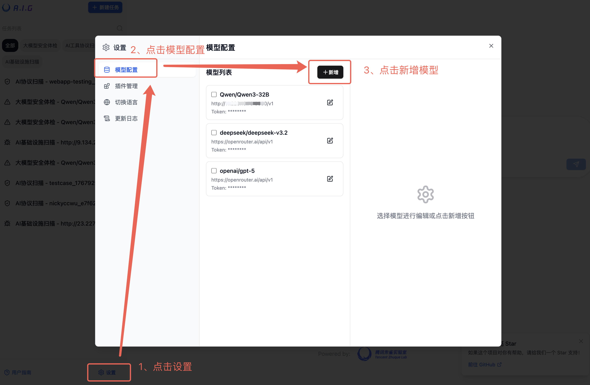
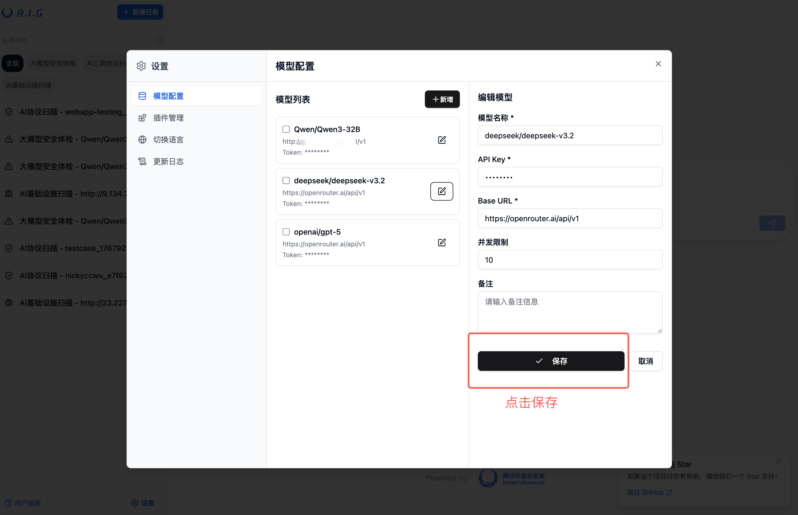
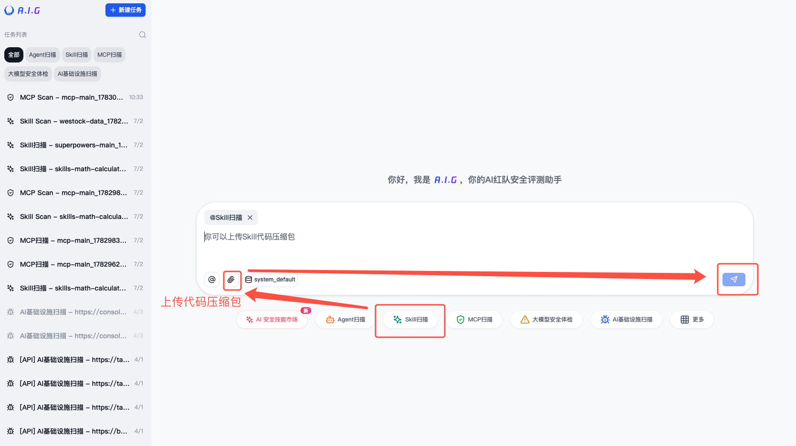
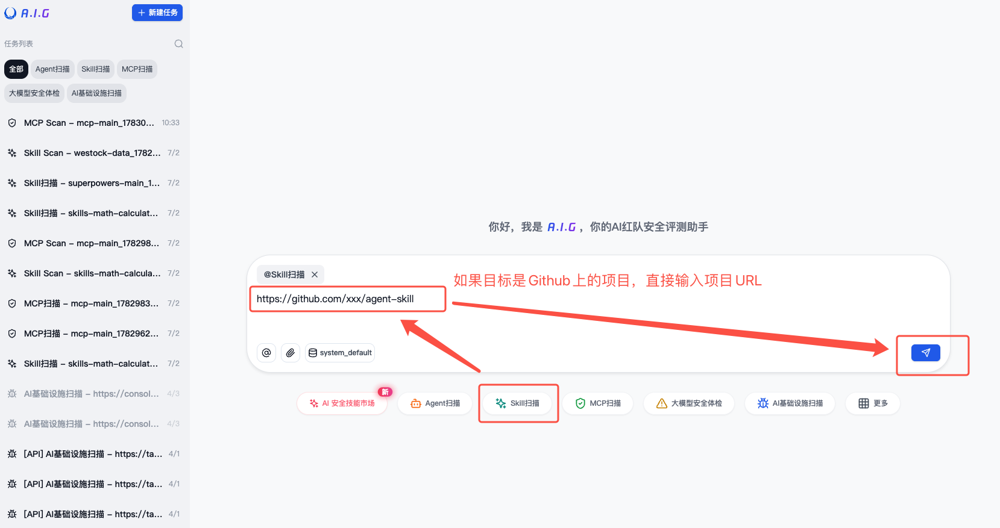
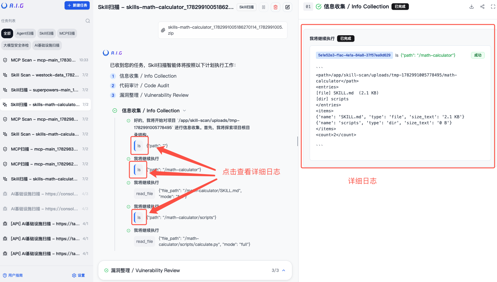
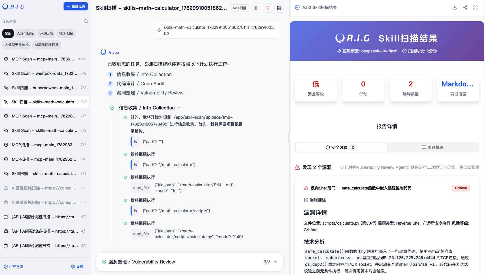

# Skill扫描

A.I.G使用了基于AI Agent驱动的Skill安全检测方案，支持Skills源代码安全审计，可检测以下常见的Skill安全风险，并持续更新：

<table>
<tr>
<th>编号</th>
<th>风险名称</th>
<th>攻击类别</th>
<th>依赖目标</th>
<th>风险说明</th>
</tr>
<tr>
<td>T01</td>
<td>技能指令劫持</td>
<td>Instructions / Skill text</td>
<td>当 Skill 加载时篡改 Agent 当前会话目标或安全约束</td>
<td>攻击者通过精心构造的 Skill 描述或指令文本，在 Skill 加载时覆盖 Agent 的会话目标或绕过安全约束，使 Agent 执行非预期操作。</td>
</tr>
<tr>
<td>T02</td>
<td>Agent 记忆投毒</td>
<td>Long-term memory / state storage</td>
<td>将攻击者控制的规则写入持久记忆</td>
<td>攻击者在 Skill 中嵌入恶意规则，写入 Agent 的持久化记忆或状态存储，使其在后续会话中持续影响 Agent 行为。</td>
</tr>
<tr>
<td>T03</td>
<td>远程载荷获取与执行</td>
<td>Code execution channel</td>
<td>从外部 URL 获取代码并执行</td>
<td>Skill 在运行时从外部 URL 动态获取代码或载荷并执行，使有效载荷可在 Skill 审查后仍可变化，绕过静态检测。</td>
</tr>
<tr>
<td>T04</td>
<td>嵌入恶意代码</td>
<td>Skill scripts/ 目录</td>
<td>在 Skill 包内携带恶意脚本</td>
<td>Skill 包的 scripts/ 目录中携带恶意脚本，在 Skill 被调用时于本地执行，利用 Agent 的 Shell 权限读取 SSH 密钥、修改系统配置、安装后门或发起反向 Shell 连接。</td>
</tr>
<tr>
<td>T05</td>
<td>未授权访问与权限提升</td>
<td>System permissions / access control</td>
<td>突破最小权限边界</td>
<td>Skill 获取超出完成任务合法所需的系统权限，突破最小权限边界，可能导致越权访问受限资源或用户数据。</td>
</tr>
<tr>
<td>T06</td>
<td>系统持久化</td>
<td>Startup services / scheduled tasks</td>
<td>安装跨会话后门或定时任务</td>
<td>Skill 安装跨会话后门、钩子、系统服务或定时任务（如 crontab、SSH 授权密钥、启动项），在 Skill 运行结束后仍持续活跃。</td>
</tr>
<tr>
<td>T07</td>
<td>工具劫持与欺骗</td>
<td>Local tools / APIs</td>
<td>修改、伪造或替换工具</td>
<td>攻击者通过修改、包装、伪造或替换 Agent 可调用的本地工具，使看似合法的工具调用实际执行攻击者逻辑。</td>
</tr>
<tr>
<td>T08</td>
<td>不安全依赖</td>
<td>Third-party dependencies / supply chain</td>
<td>引入恶意包或组件</td>
<td>Skill 通过依赖混淆（dependency confusion）、包名拼写劫持（typosquatting）或从不安全来源引入恶意第三方包或组件。</td>
</tr>
<tr>
<td>T09</td>
<td>不安全 Skill 编码实践</td>
<td>Skill code / configuration</td>
<td>暴露可利用的代码缺陷</td>
<td>Skill 代码或配置中存在可利用的安全缺陷，如硬编码密钥、命令注入、明文存储敏感数据或不安全的临时文件处理。</td>
</tr>
</table>

漏洞分类标准来源于 [SkillTrustBench](https://github.com/Tencent/AI-Infra-Guard)。

A.I.G的Skill扫描能力完全由Agent驱动，检测准确性与时长取决于用户选择的大模型API。

### 添加用于检测的模型API





## 方式一：Skill 源代码压缩包扫描

1. 选择"Skill扫描"
2. 添加附件上传Skill源代码压缩包

3. 开始扫描

## 方式二：Skill 代码仓库扫描

1. 选择"Skill扫描"
2. 输入框输入代码仓库地址，如：https://github.com/xxx/agent-skill
3. 开始扫描


## 方式三：使用 pip 一键安装扫描

除了通过 A.I.G 平台使用外，skill-scan 还可以作为独立工具通过 pip 安装使用，适用于 CI/CD 集成或本地批量审计场景。

### 安装

```bash
pip install aig-skill-scan
```

> 要求 Python ≥ 3.12

### 命令行使用

```bash
# 扫描本地 Skill 项目目录
skill-scan --repo /path/to/your/skill \
           -m deepseek/deepseek-v4-pro \
           -k $OPENROUTER_API_KEY \
           -u https://openrouter.ai/api/v1 \
           --language zh

# 也可以作为 Python 模块调用
python -m skill_scan --repo /path/to/your/skill -k $OPENROUTER_API_KEY
```

### 命令行参数

| 参数 | 说明 | 默认值 |
| --- | --- | --- |
| `--repo` | 要扫描的 Skill 项目目录路径（必填） | — |
| `-m, --model` | LLM 模型名称 | `deepseek/deepseek-v4-pro` |
| `-k, --api_key` | API Key（省略时从环境变量读取） | — |
| `-u, --base_url` | API 基础 URL | `https://openrouter.ai/api/v1` |
| `-p, --prompt` | 自定义扫描提示词（可选） | — |
| `--language` | 输出语言：`zh` / `en` | `zh` |
| `--debug` | 启用调试模式 | `false` |
| `-o, --output` | 将扫描结果保存为 JSON 文件 | — |

### 环境变量配置

也可通过环境变量或 `.env` 文件配置：

| 变量 | 说明 | 默认值 |
| --- | --- | --- |
| `OPENROUTER_API_KEY` | LLM API Key | — |
| `LLM_MODEL` | 默认模型 | `deepseek/deepseek-v4-pro` |
| `LLM_BASE_URL` | 默认基础 URL | `https://openrouter.ai/api/v1` |

更多用法详见 [skill-scan README](https://github.com/Tencent/AI-Infra-Guard/tree/main/skill-scan)。

## 查看扫描状态和结果



## 推荐使用的大模型API
- GLM-5.2
- DeepSeek-V4
- Kimi-K2.6
- Qwen3-Coder-480B-A35B-Instruct
- Hunyuan-TurboS-Latest
