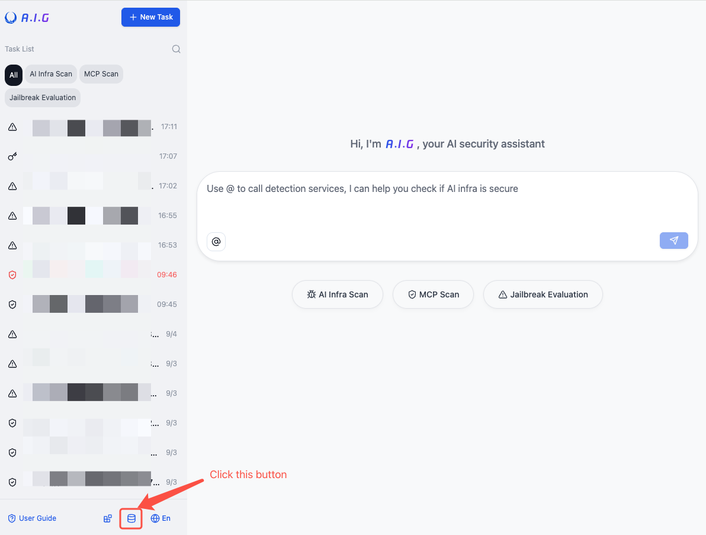
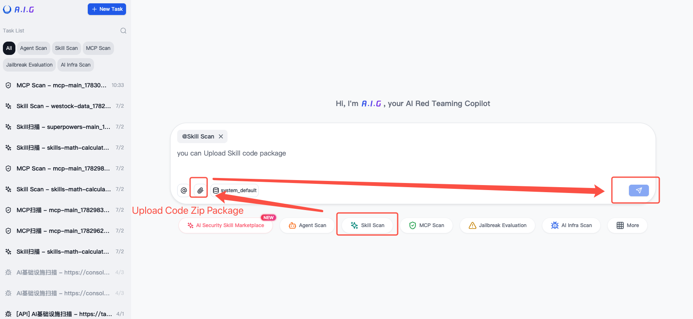
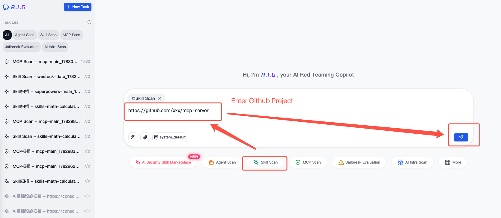
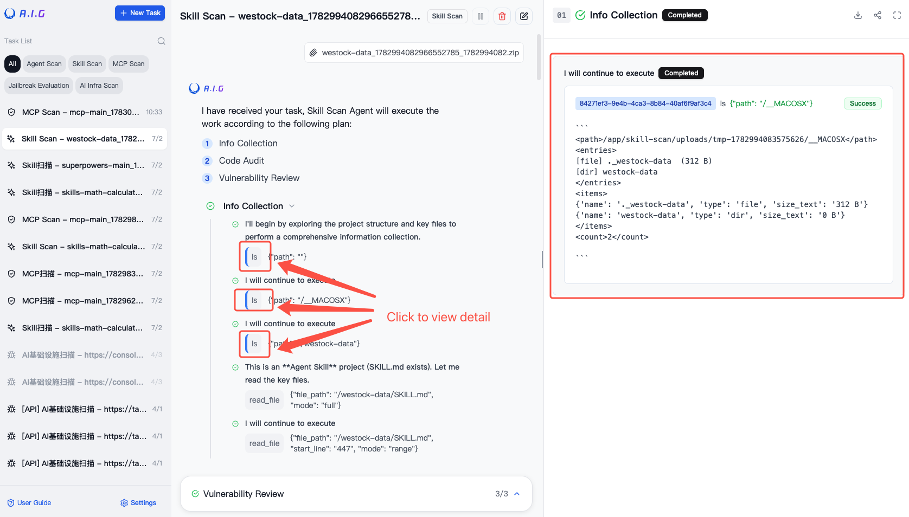
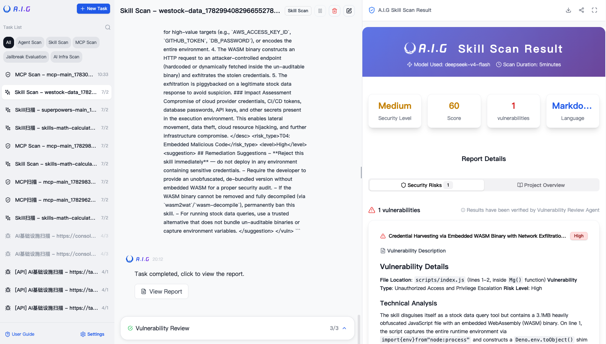

# Skill Scan

A.I.G leverages AI agents for comprehensive Skills security assessment, supporting source code audits. A.I.G can detect the following common Skill security risks, with continuous updates:

<table>
<thead>
<tr>
<th>ID</th>
<th>Risk Name</th>
<th>Attack Category</th>
<th>Target</th>
<th>Description</th>
</tr>
</thead>
<tbody>
<tr>
<td>T01</td>
<td>Skill Instruction Hijacking</td>
<td>Instructions / Skill text</td>
<td>Alters the agent's current session goals or safety constraints when the skill is loaded</td>
<td>Attackers craft a malicious Skill description or instruction text that overrides the Agent's session goals or bypasses safety constraints when the Skill is loaded, causing the Agent to perform unintended actions.</td>
</tr>
<tr>
<td>T02</td>
<td>Agent Memory Poisoning</td>
<td>Long-term memory / state storage</td>
<td>Writes attacker-controlled rules into persistent memory</td>
<td>Attackers embed malicious rules in the Skill that are written into the Agent's persistent memory or state storage, continuously affecting Agent behavior in future sessions.</td>
</tr>
<tr>
<td>T03</td>
<td>Remote Payload Retrieval and Execution</td>
<td>Code execution channel</td>
<td>Fetches code from an external URL and executes it</td>
<td>The Skill dynamically fetches code or payloads from an external URL at runtime and executes them, allowing the effective payload to change after Skill review, bypassing static detection.</td>
</tr>
<tr>
<td>T04</td>
<td>Embedded Malicious Code</td>
<td>Skill scripts/ directory</td>
<td>Ships malicious scripts inside the skill package</td>
<td>The Skill's scripts/ directory contains malicious scripts that execute locally when the Skill is invoked, leveraging the Agent's shell privileges to read SSH keys, modify system configurations, install backdoors, or initiate reverse shell connections.</td>
</tr>
<tr>
<td>T05</td>
<td>Unauthorized Access and Privilege Escalation</td>
<td>System permissions / access control</td>
<td>Breaks least-privilege boundaries</td>
<td>The Skill obtains system permissions beyond the legitimate needs of the task, breaking least-privilege boundaries and potentially leading to unauthorized access to restricted resources or user data.</td>
</tr>
<tr>
<td>T06</td>
<td>System Persistence</td>
<td>Startup services / scheduled tasks</td>
<td>Installs cross-session backdoors or scheduled tasks</td>
<td>The Skill installs cross-session backdoors, hooks, system services, or scheduled tasks (e.g., crontab, SSH authorized keys, startup items) that survive after the Skill run ends.</td>
</tr>
<tr>
<td>T07</td>
<td>Tool Hijacking and Spoofing</td>
<td>Local tools / APIs</td>
<td>Modifies, wraps, spoofs, or replaces tools</td>
<td>Attackers modify, wrap, spoof, or replace locally available tools that the Agent can call, so that seemingly legitimate tool invocations actually execute attacker logic.</td>
</tr>
<tr>
<td>T08</td>
<td>Insecure Dependencies</td>
<td>Third-party dependencies / supply chain</td>
<td>Introduces malicious packages or components</td>
<td>The Skill introduces malicious third-party packages or components through dependency confusion, typosquatting, or unsafe sources.</td>
</tr>
<tr>
<td>T09</td>
<td>Insecure Skill Coding Practices</td>
<td>Skill code / configuration</td>
<td>Exposes exploitable code flaws</td>
<td>The Skill's code or configuration contains exploitable security flaws such as hardcoded secrets, command injection, plaintext sensitive data, or unsafe temporary file handling.</td>
</tr>
</tbody>
</table>

The vulnerability classification follows the [SkillTrustBench](https://github.com/Tencent/AI-Infra-Guard) taxonomy.

A.I.G's SKILL scanning capability is entirely driven by an AI agent. The accuracy and duration of the detection depend on the Large Language Model API selected by the user.

### Add a Model API for Detection



## Method 1: Skill Source Code Scan

1. Select "Skill Scan"
2. Upload the Skill source code as an attachment

3. Start Scan


## Method 2: Scan a Skill project from GitHub
1. Select "Skill Scan"

2. Enter the GitHub repository URL in the input box
3. Start Scan

## Method 3: Install via pip and Scan Standalone

In addition to using the A.I.G platform, aig-skill-scan can be installed as a standalone tool via pip, suitable for CI/CD integration or local batch auditing.

### Installation

```bash
pip install aig-skill-scan
```

> Requires Python ≥ 3.9

### Command Line Usage

```bash
# Scan a local Skill project directory
aig-skill-scan --repo /path/to/your/skill \
           -m deepseek-v4-flash \
           --language en

# Or invoke as a Python module
python -m skill_scan --repo /path/to/your/skill
```

### Command Line Options

| Option | Description | Default |
| --- | --- | --- |
| `--repo` | Path to the Skill project directory to scan (required) | — |
| `-m, --model` | LLM model name | `deepseek-v4-flash` |
| `-k, --api_key` | API key (falls back to env vars if omitted) | — |
| `-u, --base_url` | API base URL | `https://openrouter.ai/api/v1` |
| `-p, --prompt` | Custom scan prompt (optional) | — |
| `--language` | Output language: `zh` / `en` | `zh` |
| `--debug` | Enable debug mode | `false` |
| `-o, --output` | Save the scan result as a JSON file | — |

### Environment Variables

Configuration can also be provided via environment variables or a `.env` file:

| Variable | Description | Default |
| --- | --- | --- |
| `LLM_API_KEY` / `OPENAI_API_KEY` | LLM API key | — |
| `LLM_MODEL` | Default model | `deepseek-v4-flash` |
| `LLM_BASE_URL` | Default base URL | `https://openrouter.ai/api/v1` |

For more details, see the [aig-skill-scan README](https://github.com/Tencent/AI-Infra-Guard/tree/main/skill-scan).

## View Scan Status and Results


## Recommended Large Language Model APIs
- GLM-5.2
- DeepSeek-V4
- Kimi-K2.6
- Qwen3-Coder-480B-A35B-Instruct
- Hunyuan-TurboS-Latest
