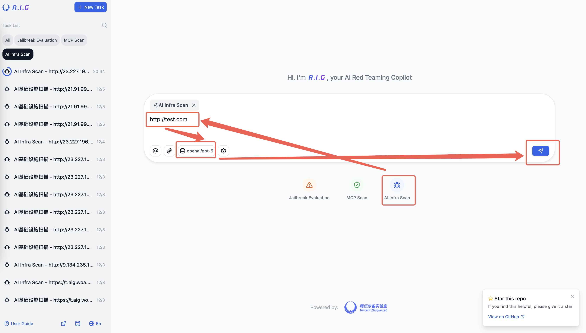
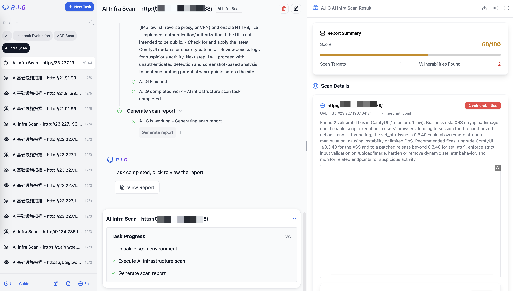
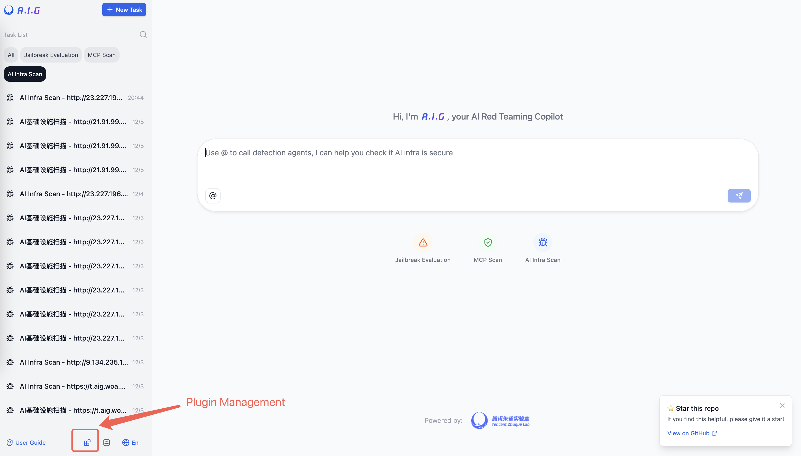
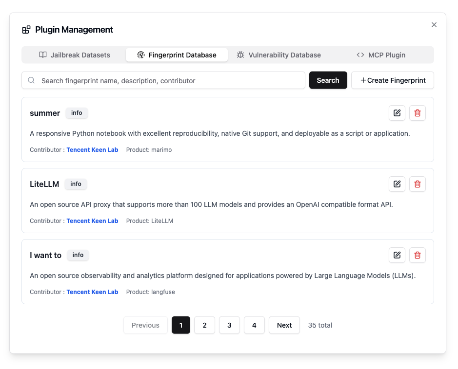

# AI Infra Scan

## Feature Overview
AI Infra Security Scan identifies known vulnerabilities (e.g., CVEs) in web services of AI infrastructure components  through precise fingerprint matching. This enables rapid detection of security gaps, empowering teams to mitigate risks proactively and maintain   secure, stable AI operations.

## Core Features
- **Comprehensive Coverage**: Identifies **100+ mainstream AI frameworks**, covering **1900+ known vulnerabilities** (CVEs).  
- **Flexible Deployment**: Supports **single-target**, **batch**, and **local service ** scanning.  
- **Intelligent Matching**: **YAML-based fingerprint rules** ensure high-precision detection accuracy.  
- **Extensibility**: Enables **custom vulnerability templates** and **fingerprint rules** for specialized deployment scenarios.

## Quick Start

### WebUI Interface Workflow

1.Select `AI Infra Scan` from the main page.

2.Configure Scan Targets
   - Enter single/multiple URLs or IP addresses (one per line)
   - Import target lists via `.txt` file upload
   - ✨ *IP inputs trigger comprehensive port scanning*
      (Automatically checks common open ports)

3.Select a MLLM to detect unauthenticated vulnerabilities, recommended GPT5/Gemini Pro/Sonnet4.5.

4.Click `Send Message` button to initiate automated vulnerability detection.
   Results will populate in real-time upon completion.





## Fingerprint & Vulnerability Database

### Built-in Fingerprint Repository
A.I.G includes **an extensive library of pre-configured AI component fingerprints**, accessible via the Plugin Management interface:


1. **Access plugin management**
   Navigate to `Plugin Management` (bottom-left of the main page)
2. **Review Built-in Resources**
   View all default fingerprint rules with search/filter capabilities
3. **Manage Fingerprints**
   Perform real-time operations:
   - 🔍 Search rules by name/description/contributor
   - ➕ Add custom fingerprints and associated vulnerabilities
   - ✏️ Edit existing fingerprints and associated vulnerabilities


▶️ Changes apply immediately – subsequent scans automatically utilize updated databases


## Supported AI Components & Vulnerability Coverage

A.I.G delivers comprehensive security coverage for critical AI infrastructure components. Current supported components and vulnerability statistics:

| Category                   | Component Name          | Vulnerability Count | Risk Level  |
| -------------------------- | ----------------------- | ------------------- | ----------- |
| **Model Serving**          | gradio                  | 49                  | High        |
|                            | ollama                  | 28                  | Medium-High |
|                            | triton-inference-server | 35                  | Medium-High |
|                            | vllm                    | 60                  | Medium      |
|                            | xinference              | 3                   | Low         |
|                            | fastchat                | 9                   | Medium      |
|                            | llama-cpp               | 9                   | Medium-High |
|                            | llmstudio               | 1                   | Low         |
|                            | ChatRTX                 | 1                   | Low         |
|                            | kubeai                  | 1                   | High        |
| **LLM App Frameworks**     | langchain               | 52                  | High        |
|                            | dify                    | 31                  | High        |
|                            | anythingllm             | 18                  | Medium-High |
|                            | open-webui              | 49                  | Medium-High |
|                            | ragflow                 | 12                  | Medium      |
|                            | qanything               | 8                   | Medium      |
|                            | langflow                | 50                  | Medium      |
|                            | litellm                 | 29                  | Medium      |
|                            | mlflow                  | 76                  | High        |
|                            | librechat               | 21                  | Medium      |
|                            | nextchat                | 8                   | Medium      |
|                            | lobechat                | 4                   | Medium      |
|                            | lobehub                 | 1                   | Medium      |
|                            | flowise                 | 55                  | Medium      |
|                            | langfuse                | 4                   | Low         |
|                            | new-api                 | 2                   | Medium      |
|                            | Chuanhugpt              | 27                  | Medium-High |
|                            | crewai                  | 3                   | Critical    |
|                            | fastgpt                 | 1                   | Medium      |
| **Data Processing**        | clickhouse              | 25                  | High        |
|                            | feast                   | 2                   | Low         |
|                            | dask                    | 3                   | Low         |
| **Visualization & UI**     | jupyter-server          | 15                  | Medium-High |
|                            | jupyterlab              | 8                   | Medium      |
|                            | jupyter-notebook        | 2                   | Low         |
| **Workflow Orchestration** | kubeflow                | 4                   | Medium      |
|                            | ray                     | 10                  | Medium      |
|                            | n8n                     | 48                  | Medium-High |
|                            | n8n-mcp                 | 3                   | Medium-High |
|                            | simstudioai             | 9                   | Medium      |
| **Other AI Components**    | comfyui                 | 13                  | Medium      |
|                            | comfy_mtb               | 1                   | Low         |
|                            | ComfyUI-Prompt-Preview  | 1                   | Low         |
|                            | ComfyUI-Custom-Scripts  | 1                   | Low         |
|                            | ComfyUI-Impact-Pack     | 1                   | Low         |
|                            | ComfyUI-Manager         | 1                   | Low         |
|                            | ComfyUI-Ace-Nodes       | 1                   | Low         |
|                            | ComfyUI-Bmad-Nodes      | 1                   | Low         |
|                            | pyload-ng               | 24                  | Medium      |
|                            | kubepi                  | 5                   | Medium      |
|                            | llamafactory            | 4                   | Low         |
|                            | bentoml                 | 4                   | Medium      |
|                            | blinko                  | 1                   | Low         |
|                            | weknora                 | 2                   | Low         |
|                            | pinchtab                | 6                   | Medium-High |
|                            | wallos                  | 1                   | Low         |
|                            | praisonai               | 5                   | Medium      |
|                            | text-generation-webui   | 1                   | Medium      |
|                            | openclaw                | 1069                | Medium-High |
|                            | upsonic                 | 1                   | Medium      |
|                            | instructlab             | 1                   | Low         |
|                            | lmdeploy                | 3                   | Low         |
|                            | paperclip               | 2                   | Medium      |
|                            | pipecat                 | 2                   | Low         |
|                            | qnabot-on-aws           | 1                   | Low         |
|                            | superagi                | 1                   | Low         |
|                    | autogpt                 | 3                   | Medium      |
|                            | boxlite                 | 1                   | Medium      |
|                            | budibase                | 1                   | Medium      |
|                            | f5-tts                  | 1                   | Medium      |
|                            | lumiverse               | 1                   | Low         |
|                            | maxkb                   | 1                   | Medium      |
|                            | mem0                    | 1                   | Low         |
|                            | pgadmin                 | 2                   | Medium-High |
|                            | sglang                  | 6                   | Medium      |
|                            | sillytavern             | 5                   | Medium      |
| **AI Agent Config Security** | AI-Agent-Config       | 1                   | High        |
| **Total**                  |                         | **1900+**           |             |

> **Note**: The vulnerability database is continuously updated. Regular scanning of high-risk components is recommended.

## Fingerprint Matching Rule Details

### Rule Structure

AI Infra Guard uses YAML format to define fingerprint matching rules, which mainly include the following parts:

```yaml
info:
  name: Component Name
  author: Rule Author
  severity: Information Level
  metadata:
    product: Product Name
    vendor: Vendor Name
http:
  - method: HTTP Request Method
    path: Request Path
    matchers:
      - Matching Conditions
```

### Example: Dify Fingerprint Rule

```yaml
info:
  name: dify
  author: Tencent Zhuque Lab
  severity: info
  metadata:
    product: dify
    vendor: dify
http:
  - method: GET
    path: '/'
    matchers:
      - body="<title>Dify</title>" || icon="97378986"
version:
  - method: GET
    path: '/console/api/version'
    extractor:
      part: header
      group: 1
      regex: 'x-version:\s*(\d+\.\d+\.?\d+?)'
```

### Matcher Syntax Explanation

#### Match Locations

| Location | Description             | Example                                   |
| -------- | ----------------------- | ----------------------------------------- |
| `title`  | HTML page title         | `title="Gradio"`                          |
| `body`   | HTTP response body      | `body="gradio-config"`                    |
| `header` | HTTP response header    | `header="X-Gradio-Version: 3.34.0"`       |
| `icon`   | Website favicon hash    | `icon="d41d8cd98f00b204e9800998ecf8427e"` |

#### Logical Operators

| Operator | Description                               | Example                                                      |
| -------- | ----------------------------------------- | ------------------------------------------------------------ |
| `=`      | Fuzzy contains match (case-insensitive)   | `body="gradio"`                                              |
| `==`     | Exact equals match (case-sensitive)       | `header="Server: Gradio"`                                    |
| `!=`     | Not equals match                          | `header!="Server: Apache"`                                   |
| `~=`     | Regular expression match                  | `body~="Gradio v[0-9]+.[0-9]+.[0-9]+"`                       |
| `&&`     | Logical AND                               | `body="gradio" && header="X-Gradio-Version"`                 |
| `||`     | Logical OR                                | `body="gradio" || body="Gradio"`                             |
| `()`     | Grouping to change precedence             | `(body="gradio" || body="Gradio") && header="X-Gradio-Version"` |

## Operational Best Practices


1.**Schedule Regular Scans**: Schedule weekly comprehensive scans of your AI infrastructure to promptly identify emerging vulnerabilities.

2.**Prioritize High-Risk Components**: Focus scanning resources on components with high vulnerability densities, such as Gradio, LangChain, and ClickHouse.

3.**Extend with Custom Rules**: Enhance detection capabilities for organization-specific AI components by adding custom fingerprint rules.

4.**Integrate into CI/CD Pipelines**: Embed security scanning into the continuous integration (CI) process for AI applications to implement shift-left security.

5.**Track Vulnerability Remediation**: Establish a tracking mechanism for vulnerabilities discovered during scans to ensure timely remediation.

By leveraging the AI Infra Scan service, you can effectively identify potential security risks within your AI systems, providing robust assurance for building a secure and reliable AI infrastructure.