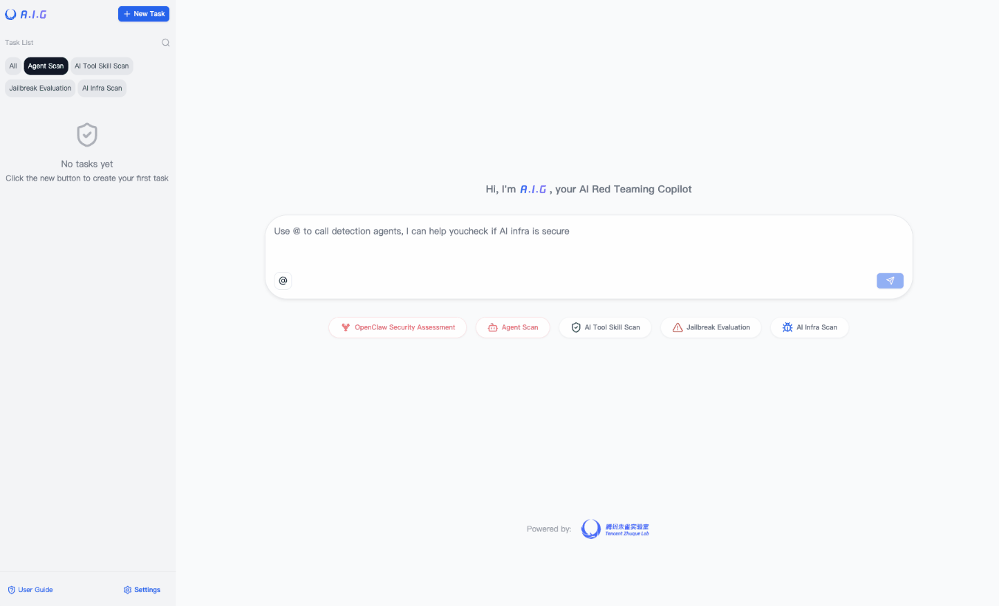
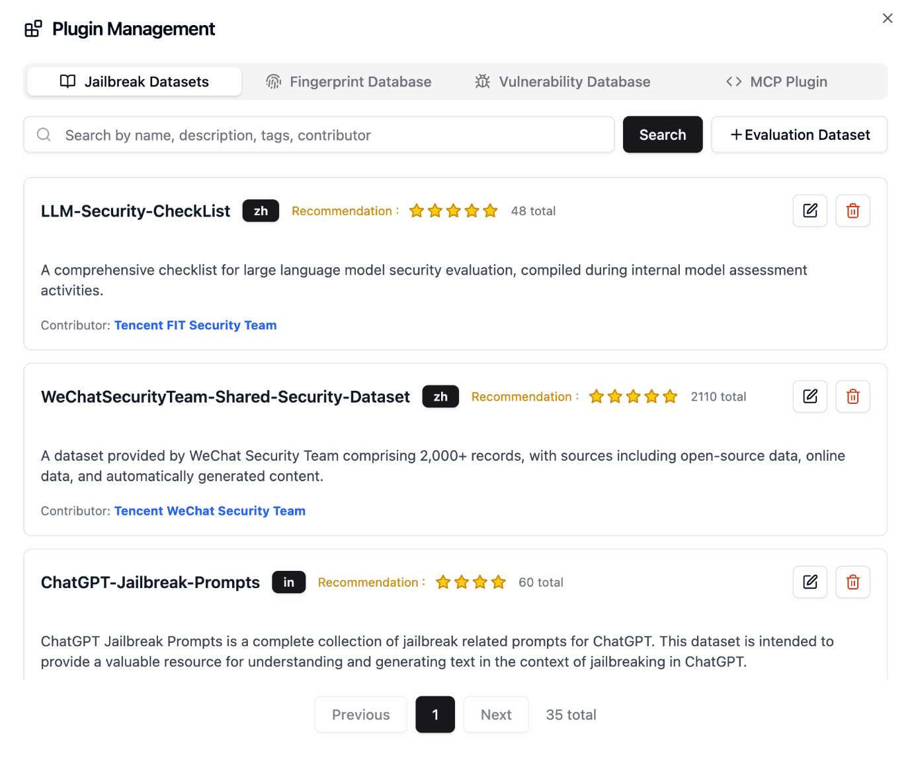
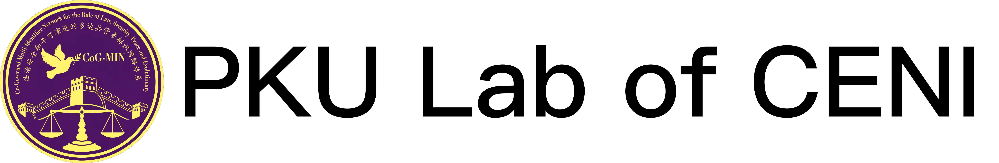
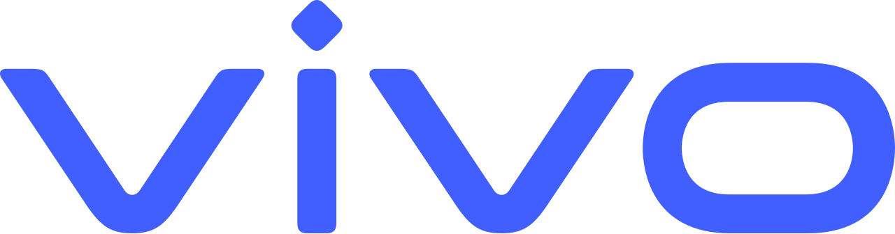
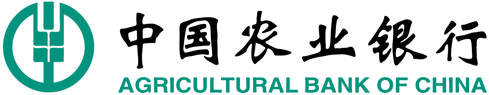
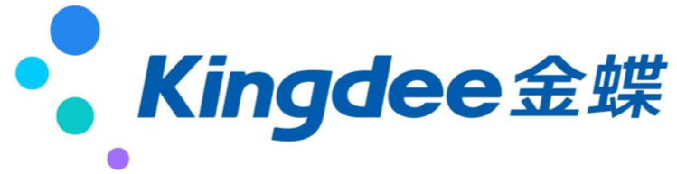
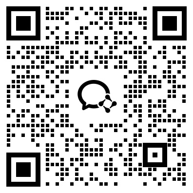

<p align="center">
    <h1 align="center"></h1>
</p>
<p align="center">
  <a href="https://tencent.github.io/AI-Infra-Guard/">📖 Documentation</a> &nbsp;|&nbsp;
  🌐 <a href="../README.md">🇬🇧 English</a> · <a href="./README_ZH.md">🇨🇳 中文</a> · <a href="./README_JA.md">🇯🇵 日本語</a> · <a href="./README_ES.md">🇪🇸 Español</a> · <a href="./README_DE.md">🇩🇪 Deutsch</a> · <b>🇫🇷 Français</b> · <a href="./README_KR.md">🇰🇷 한국어</a> · <a href="./README_PT.md">🇧🇷 Português</a> · <a href="./README_RU.md">🇷🇺 Русский</a>
</p>
<p align="center">
    <a href="https://github.com/tencent/AI-Infra-Guard/stargazers">
      
    </a>
    <a href="https://github.com/Tencent/AI-Infra-Guard">
        
    </a>
    <a href="https://github.com/Tencent/AI-Infra-Guard">
        
    </a>
    <a href="https://github.com/Tencent/AI-Infra-Guard">
        
    </a>
    <a href="https://deepwiki.com/Tencent/AI-Infra-Guard">
       
    </a>
</p>
<p align="center">
    <a href="https://clawhub.ai/aigsec/edgeone-clawscan" target="_blank">
       
    </a>
    <a href="https://clawhub.ai/aigsec/edgeone-skill-scanner" target="_blank">
       
    </a>
    <a href="https://clawhub.ai/aigsec/aig-scanner" target="_blank">
       
    </a>
</p>
<p align="center">
  <a href="https://trendshift.io/repositories/13637" target="_blank"><picture><source media="(prefers-color-scheme: dark)" srcset="https://trendshift.io/api/badge/repositories/13637"><source media="(prefers-color-scheme: light)" srcset="https://trendshift.io/api/badge/repositories/13637"></picture></a>&nbsp;
  <a href="https://www.blackhat.com/eu-25/arsenal/schedule/index.html#aigai-infra-guard-48381" target="_blank"></a>&nbsp;
  <a href="https://github.com/deepseek-ai/awesome-deepseek-integration" target="_blank"></a>
</p>

<br>

<p align="center">
    <h2 align="center">🚀 Plateforme de Red Teaming IA par Tencent Zhuque Lab</h2>
</p>

<b>A.I.G (AI-Infra-Guard)</b> intègre des fonctionnalités telles que ClawScan (OpenClaw Security Scan), Agent Scan, l'analyse de vulnérabilités de l'infrastructure IA, l'analyse MCP Server & Agent Skills, ainsi que Jailbreak Evaluation, dans le but de fournir aux utilisateurs la solution la plus complète, intelligente et conviviale pour l'autoévaluation des risques de sécurité IA.

<p>
  Nous nous engageons à faire d'A.I.G (AI-Infra-Guard) la plateforme de red teaming IA de référence dans l'industrie. Plus d'étoiles permettent à ce projet de toucher un public plus large, attirant davantage de développeurs à contribuer, ce qui accélère l'itération et l'amélioration. Votre étoile est cruciale pour nous !
</p>
<p align="center">
  <a href="https://github.com/Tencent/AI-Infra-Guard">
      
  </a>
</p>

<br>

## 🚀 Nouveautés

- **2026-04-23** · [v4.1.5](https://github.com/Tencent/AI-Infra-Guard/releases/tag/v4.1.5) — Détection de jailbreak pour Agent Scan ; détecte les fichiers de configuration d'AI Agent exposés.
- **2026-04-17** · [v4.1.4](https://github.com/Tencent/AI-Infra-Guard/releases/tag/v4.1.4) — Les endpoints de modèle HTTPS avec certificats auto-signés sont désormais pris en charge.
- **2026-04-09** · [v4.1.3](https://github.com/Tencent/AI-Infra-Guard/releases/tag/v4.1.3) — Couverture étendue à 55 composants IA ; ajout de crewai, kubeai, lobehub.
- **2026-04-03** · [v4.1.2](https://github.com/Tencent/AI-Infra-Guard/releases/tag/v4.1.2) — Trois nouveaux skills sur ClawHub (`edgeone-clawscan`, `edgeone-skill-scanner`, `aig-scanner`) + arrêt manuel des tâches.
- **2026-03-25** · [v4.1.1](https://github.com/Tencent/AI-Infra-Guard/releases/tag/v4.1.1) — ☠️ Détecte l'attaque de la chaîne d'approvisionnement LiteLLM (CRITIQUE) ; ajout de la couverture Blinko & New-API.

👉 [CHANGELOG](../CHANGELOG.md) · 🩺 [Essayer EdgeOne ClawScan](https://matrix.tencent.com/clawscan)


## Table des matières
- [🚀 Démarrage rapide](#-démarrage-rapide)
- [✨ Fonctionnalités](#-fonctionnalités)
- [🖼️ Galerie](#-galerie)
- [📖 Guide utilisateur](#-guide-utilisateur)
- [🔧 Documentation API](#-documentation-api)
- [🏗️ Évolution de l'Architecture](../docs/architecture_evolution.md)
- [📝 Guide de contribution](#-guide-de-contribution)
- [🙏 Remerciements](#-remerciements)
- [💬 Rejoindre la communauté](#-rejoindre-la-communauté)
- [📖 Citation](#-citation)
- [📚 Articles connexes](#-articles-connexes)
- [⚖️ Licence & Attribution](#️-licence--attribution)
<br><br>
## 🚀 Démarrage rapide
### Déploiement avec Docker

| Docker | RAM | Espace disque |
|:-------|:----|:----------|
| 20.10 ou supérieur | 4 Go+ | 10 Go+ |

```bash
# Cette méthode télécharge des images pré-construites depuis Docker Hub pour un démarrage plus rapide
git clone https://github.com/Tencent/AI-Infra-Guard.git
cd AI-Infra-Guard
# Pour Docker Compose V2+, remplacez 'docker-compose' par 'docker compose'
docker-compose -f docker-compose.images.yml up -d
```

Une fois le service lancé, vous pouvez accéder à l'interface web d'A.I.G à l'adresse :
`http://localhost:8088`
<br>

### Utilisation depuis OpenClaw

Vous pouvez également appeler A.I.G directement depuis le chat OpenClaw via le skill `aig-scanner`.

```bash
clawhub install aig-scanner
```

Configurez ensuite `AIG_BASE_URL` pour pointer vers votre service A.I.G en cours d'exécution.

Pour plus de détails, consultez le [README `aig-scanner`](../skills/aig-scanner/README.md).

<details>
<summary><strong>📦 Autres options d'installation</strong></summary>

### Autres méthodes d'installation

**Méthode 2 : Script d'installation en un clic (Recommandé)**
```bash
# Cette méthode installera automatiquement Docker et lancera A.I.G en une seule commande
curl https://raw.githubusercontent.com/Tencent/AI-Infra-Guard/refs/heads/main/docker.sh | bash
```

**Méthode 3 : Compilation et exécution depuis les sources**
```bash
git clone https://github.com/Tencent/AI-Infra-Guard.git
cd AI-Infra-Guard
# Cette méthode compile une image Docker à partir du code source local et démarre le service
# (Pour Docker Compose V2+, remplacez 'docker-compose' par 'docker compose')
docker-compose up -d
```

Remarque : Le projet AI-Infra-Guard est positionné comme une plateforme de red teaming IA pour usage interne par des entreprises ou des particuliers. Il ne dispose actuellement pas de mécanisme d'authentification et ne doit pas être déployé sur des réseaux publics.

Pour plus d'informations, voir : [https://tencent.github.io/AI-Infra-Guard/?menu=getting-started](https://tencent.github.io/AI-Infra-Guard/?menu=getting-started)

</details>

### Essayer la version Pro en ligne
Découvrez la version Pro avec des fonctionnalités avancées et des performances améliorées. La version Pro nécessite un code d'invitation et est prioritairement réservée aux contributeurs ayant soumis des issues, des pull requests ou des discussions, ou qui aident activement à développer la communauté. Visitez : [https://aigsec.ai/](https://aigsec.ai/).
<br>
<br>

## ✨ Fonctionnalités

| Fonctionnalité | Plus d'informations |
|:--------|:------------|
| **ClawScan(OpenClaw&nbsp;Security&nbsp;Scan)** | Prend en charge l'évaluation en un clic des risques de sécurité OpenClaw. Détecte les configurations non sécurisées, les risques liés aux Skills, les vulnérabilités CVE et les fuites de confidentialité. |
| **Agent&nbsp;Scan** | Framework d'analyse automatisée multi-agents indépendant, conçu pour évaluer la sécurité des workflows d'agents IA. Prend en charge de façon transparente les agents fonctionnant sur diverses plateformes, notamment Dify et Coze. |
| **MCP&nbsp;Server&nbsp;&&nbsp;Agent&nbsp;Skills&nbsp;scan** | Détecte de manière approfondie 14 grandes catégories de risques de sécurité. La détection s'applique aussi bien aux MCP Servers qu'aux Agent Skills. Prend en charge de manière flexible l'analyse à partir du code source et d'URLs distantes. |
| **AI&nbsp;infra&nbsp;vulnerability&nbsp;scan** | Identifie précisément plus de 57 composants de frameworks IA. Couvre plus de 1 000 vulnérabilités CVE connues. Les frameworks supportés incluent Ollama, ComfyUI, vLLM, n8n, Triton Inference Server et bien d'autres. |
| **Jailbreak&nbsp;Evaluation** | Évalue les risques de sécurité des prompts à l'aide de datasets soigneusement sélectionnés. L'évaluation applique plusieurs méthodes d'attaque pour tester la robustesse. Fournit également des capacités détaillées de comparaison inter-modèles. |

<details>
<summary><strong>💎 Avantages supplémentaires</strong></summary>

- 🖥️ **Interface web moderne** : Interface conviviale avec analyse en un clic et suivi de progression en temps réel
- 🔌 **API complète** : Documentation d'interface complète et spécifications Swagger pour une intégration facile
- 🤖 **Prêt pour les agents** : Skills d'agent prêts à l'emploi sur ClawHub - [EdgeOne ClawScan](https://clawhub.ai/aigsec/edgeone-clawscan), [EdgeOne Skill Scanner](https://clawhub.ai/aigsec/edgeone-skill-scanner) et [AIG Scanner](https://clawhub.ai/aigsec/aig-scanner) - intégrez l'analyse de sécurité dans n'importe quel workflow d'agent IA en toute simplicité
- 🌐 **Multi-langue** : Interfaces en chinois et en anglais avec documentation localisée
- 🐳 **Multi-plateforme** : Prise en charge Linux, macOS et Windows avec déploiement basé sur Docker
- 🆓 **Gratuit et open source** : Entièrement gratuit sous la licence Apache 2.0
</details>

<br />


## 🖼️ Galerie

### Interface principale d'A.I.G


### Gestion des plugins


<br />


## 🗺️ Guide d'utilisation rapide

> Après le déploiement, ouvrez `http://localhost:8088` dans votre navigateur.

### Analyse de vulnérabilités de l'infrastructure IA

**Que saisir comme URL / IP cible ?**

La cible est l'**adresse réseau d'un service IA en cours d'exécution** que vous souhaitez analyser - pas une URL GitHub ou un chemin de code source. A.I.G se connecte au service actif et l'identifie pour détecter les vulnérabilités CVE connues.

| Scénario | Exemple de cible |
|:---------|:--------------|
| Une instance vLLM en cours d'exécution localement | `http://127.0.0.1:8000` |
| Un serveur Ollama sur votre réseau local | `http://192.168.1.100:11434` |
| Une instance ComfyUI exposée en interne | `http://10.0.0.5:8188` |
| Plusieurs hôtes (un par ligne) | `192.168.1.0/24` (CIDR), `10.0.0.1-10.0.0.20` (plage) |

**Étape par étape : Analyser une instance vLLM locale**

1. Démarrez vLLM normalement (ex. `python -m vllm.entrypoints.api_server --model meta-llama/...`)
2. Dans l'interface web d'A.I.G, cliquez sur **"AI基础设施安全扫描 / AI Infra Scan"**
3. Saisissez `http://127.0.0.1:8000` (ou l'IP/port sur lequel vLLM écoute)
4. Cliquez sur **Start Scan** - A.I.G va identifier le service et le comparer à plus de 1 000 CVE connus
5. Consultez le rapport : version du composant, vulnérabilités détectées, sévérité et liens de remédiation

> 💡 **Conseil** : Pour analyser spécifiquement la version *nightly* de vLLM, lancez simplement ce build nightly et pointez A.I.G vers son adresse. Le scanner détecte automatiquement la version.

### Analyse MCP Server & Agent Skills

Saisissez soit une **URL distante** (ex. `https://github.com/user/mcp-server`) soit **chargez une archive source locale** - aucune instance en cours d'exécution n'est requise.

### Jailbreak Evaluation

Configurez l'endpoint API du LLM cible (URL de base + clé API) dans **Paramètres → Configuration du modèle**, puis sélectionnez un dataset et démarrez l'évaluation.

---

## 📖 Guide utilisateur

Consultez notre documentation en ligne : [https://tencent.github.io/AI-Infra-Guard/](https://tencent.github.io/AI-Infra-Guard/)

Pour des FAQ détaillées et des guides de dépannage, consultez notre [documentation](https://tencent.github.io/AI-Infra-Guard/?menu=faq).
<br />
<br>

## 🔧 Documentation API

A.I.G fournit un ensemble complet d'API de création de tâches prenant en charge les capacités d'analyse d'infrastructure IA, d'analyse MCP Server et de Jailbreak Evaluation.

Une fois le projet lancé, visitez `http://localhost:8088/docs/index.html` pour consulter la documentation API complète.

Pour des instructions d'utilisation détaillées, des descriptions de paramètres et des exemples de code complets, veuillez consulter la [Documentation API complète](../api.md).
<br />
<br>

## 📝 Guide de contribution

Le framework de plugins extensible constitue la pierre angulaire de l'architecture d'A.I.G, invitant l'innovation communautaire via des contributions de plugins et de fonctionnalités.

### Règles de contribution aux plugins
1.  **Règles de fingerprint** : Ajoutez de nouveaux fichiers YAML de fingerprint dans le répertoire `data/fingerprints/`.
2.  **Règles de vulnérabilités** : Ajoutez de nouvelles règles d'analyse de vulnérabilités dans le répertoire `data/vuln/`.
3.  **Plugins MCP** : Ajoutez de nouvelles règles d'analyse de sécurité MCP dans le répertoire `data/mcp/`.
4.  **Datasets Jailbreak Evaluation** : Ajoutez de nouveaux datasets d'évaluation Jailbreak dans le répertoire `data/eval`.

Veuillez vous référer aux formats de règles existants, créer de nouveaux fichiers et les soumettre via une Pull Request.

### Autres façons de contribuer
- 🐛 [Signaler un bug](https://github.com/Tencent/AI-Infra-Guard/issues)
- 💡 [Suggérer une nouvelle fonctionnalité](https://github.com/Tencent/AI-Infra-Guard/issues)
- ⭐ [Améliorer la documentation](https://github.com/Tencent/AI-Infra-Guard/pulls)
<br />
<br />

## 🙏 Remerciements

### 🎓 Collaborations académiques

Nous exprimons notre sincère reconnaissance à nos partenaires académiques pour leurs contributions exceptionnelles à la recherche et leur soutien technique.

#### 
<table>
  <tr>
    <td align="center" width="90">
      <a href="#">
        
      </a>
      <br />
      <a href="#">
        <sub><b>Prof.&nbsp;hui&nbsp;Li</b></sub>
      </a>
    </td>
    <td align="center" width="90">
      <a href="https://github.com/TheBinKing">
        
      </a>
      <br />
      <a href="mailto:1546697086@qq.com">
        <sub><b>Bin&nbsp;Wang</b></sub>
      </a>
    </td>
    <td align="center" width="90">
      <a href="https://github.com/KPGhat">
        
      </a>
      <br />
      <a href="mailto:kpghat@gmail.com">
        <sub><b>Zexin&nbsp;Liu</b></sub>
      </a>
    </td>
    <td align="center" width="90">
      <a href="https://github.com/GioldDiorld">
        
      </a>
      <br />
      <a href="mailto:g.diorld@gmail.com">
        <sub><b>Hao&nbsp;Yu</b></sub>
      </a>
    </td>
    <td align="center" width="90">
      <a href="https://github.com/Jarvisni">
        
      </a>
      <br />
      <a href="mailto:719001405@qq.com">
        <sub><b>Ao&nbsp;Yang</b></sub>
      </a>
    </td>
    <td align="center" width="90">
      <a href="https://github.com/Zhengxi7">
        
      </a>
      <br />
      <a href="mailto:linzhengxi7@126.com">
        <sub><b>Zhengxi&nbsp;Lin</b></sub>
      </a>
    </td>
  </tr>
</table>

#### 

<table>
  <tr>
    <td align="center" width="120">
      <a href="https://yangzhemin.github.io/">
        
      </a>
      <br />
      <a href="mailto:yangzhemin@fudan.edu.cn">
        <sub><b>Prof.&nbsp;Zhemin&nbsp;Yang</b></sub>
      </a>
    </td>
    <td align="center" width="100">
      <a href="https://github.com/kangwei-zhong">
        
      </a>
      <br />
      <a href="mailto:kwzhong23@m.fudan.edu.cn">
        <sub><b>Kangwei&nbsp;Zhong</b></sub>
      </a>
    </td>
    <td align="center" width="90">
      <a href="https://github.com/MoonBirdLin">
        
      </a>
      <br />
      <a href="mailto:linjp23@m.fudan.edu.cn">
        <sub><b>Jiapeng&nbsp;Lin</b></sub>
      </a>
    </td>
    <td align="center" width="90">
      <a href="https://vanilla-tiramisu.github.io/">
        
      </a>
      <br />
      <a href="mailto:csheng25@m.fudan.edu.cn">
        <sub><b>Cheng&nbsp;Sheng</b></sub>
      </a>
    </td>
  </tr>
</table>
<br>

### 👥 Remerciements aux développeurs contributeurs
Merci à tous les développeurs qui ont contribué au projet A.I.G. Vos contributions ont été déterminantes pour faire d'A.I.G une plateforme de Red Team IA plus robuste et fiable.
<br />
<table border="0" cellspacing="0" cellpadding="0">
  <tr>
    <td width="33%"></td>
    <td width="33%"></td>
    <td width="33%"></td>
  </tr>
</table>
<a href="https://github.com/Tencent/AI-Infra-Guard/graphs/contributors">
  
</a>
<br>
<br>

### 🤝 Reconnaissance envers nos utilisateurs

Merci aux utilisateurs des entreprises et équipes suivantes pour leur utilisation d'A.I.G et leurs précieux retours.

<br>
<div align="center">









</div>

<br>
<div align="center">


</div>

<br>

## 💬 Rejoindre la communauté

### 🌐 Discussions en ligne
- **GitHub Discussions** : [Rejoignez les discussions de notre communauté](https://github.com/Tencent/AI-Infra-Guard/discussions)
- **Issues & Rapports de bugs** : [Signalez des problèmes ou suggérez des fonctionnalités](https://github.com/Tencent/AI-Infra-Guard/issues)

### 📱 Communauté de discussion
<table>
  <thead>
  <tr>
    <th>Groupe WeChat</th>
    <th>Discord <a href="https://discord.gg/U9dnPnyadZ">[lien]</a></th>
  </tr>
  </thead>
  <tbody>
  <tr>
    <td></td>
    <td></td>
  </tr>
  </tbody>
</table>

### 📧 Nous contacter
Pour des demandes de collaboration ou des retours, veuillez nous contacter à : [zhuque@tencent.com](mailto:zhuque@tencent.com)

### 🔗 Outils de sécurité recommandés
Si vous vous intéressez à la sécurité du code, consultez [A.S.E (AICGSecEval)](https://github.com/Tencent/AICGSecEval), le premier framework d'évaluation de la sécurité du code généré par IA au niveau dépôt, open-sourcé par la Tencent Wukong Code Security Team.


<br>
<br>

## 📖 Citation

Si vous utilisez A.I.G dans vos recherches, veuillez citer :

```bibtex
@misc{Tencent_AI-Infra-Guard_2025,
  author={{Tencent Zhuque Lab}},
  title={{AI-Infra-Guard: A Comprehensive, Intelligent, and Easy-to-Use AI Red Teaming Platform}},
  year={2025},
  howpublished={GitHub repository},
  url={https://github.com/Tencent/AI-Infra-Guard}
}
```
<br>

## 📚 Articles connexes

<details>
<summary>Nous sommes profondément reconnaissants envers les équipes de recherche qui ont utilisé A.I.G dans leurs travaux académiques. Cliquez pour développer (17 articles)</summary>
<br>

1. Naen Xu, Jinghuai Zhang, Ping He et al. **"FraudShield: Knowledge Graph Empowered Defense for LLMs against Fraud Attacks."** arXiv preprint arXiv:2601.22485v1 (2026). [[pdf]](http://arxiv.org/abs/2601.22485v1)

2. Ruiqi Li, Zhiqiang Wang, Yunhao Yao et al. **"MCP-ITP: An Automated Framework for Implicit Tool Poisoning in MCP."** arXiv preprint arXiv:2601.07395v1 (2026). [[pdf]](http://arxiv.org/abs/2601.07395v1)

3. Jingxiao Yang, Ping He, Tianyu Du et al. **"HogVul: Black-box Adversarial Code Generation Framework Against LM-based Vulnerability Detectors."** arXiv preprint arXiv:2601.05587v1 (2026). [[pdf]](http://arxiv.org/abs/2601.05587v1)

4. Yunyi Zhang, Shibo Cui, Baojun Liu et al. **"Beyond Jailbreak: Unveiling Risks in LLM Applications Arising from Blurred Capability Boundaries."** arXiv preprint arXiv:2511.17874v2 (2025). [[pdf]](http://arxiv.org/abs/2511.17874v2)

5. Teofil Bodea, Masanori Misono, Julian Pritzi et al. **"Trusted AI Agents in the Cloud."** arXiv preprint arXiv:2512.05951v1 (2025). [[pdf]](http://arxiv.org/abs/2512.05951v1)

6. Christian Coleman. **"Behavioral Detection Methods for Automated MCP Server Vulnerability Assessment."** [[pdf]](https://digitalcommons.odu.edu/cgi/viewcontent.cgi?article=1138&context=covacci-undergraduateresearch)

7. Bin Wang, Zexin Liu, Hao Yu et al. **"MCPGuard: Automatically Detecting Vulnerabilities in MCP Servers."** arXiv preprint arXiv:2510.23673v1 (2025). [[pdf]](http://arxiv.org/abs/2510.23673v1)

8. Weibo Zhao, Jiahao Liu, Bonan Ruan et al. **"When MCP Servers Attack: Taxonomy, Feasibility, and Mitigation."** arXiv preprint arXiv:2509.24272v1 (2025). [[pdf]](http://arxiv.org/abs/2509.24272v1)

9. Ping He, Changjiang Li, et al. **"Automatic Red Teaming LLM-based Agents with Model Context Protocol Tools."** arXiv preprint arXiv:2509.21011 (2025). [[pdf]](https://arxiv.org/abs/2509.21011)

10. Yixuan Yang, Daoyuan Wu, Yufan Chen. **"MCPSecBench: A Systematic Security Benchmark and Playground for Testing Model Context Protocols."** arXiv preprint arXiv:2508.13220 (2025). [[pdf]](https://arxiv.org/abs/2508.13220)

11. Zexin Wang, Jingjing Li, et al. **"A Survey on AgentOps: Categorization, Challenges, and Future Directions."** arXiv preprint arXiv:2508.02121 (2025). [[pdf]](https://arxiv.org/abs/2508.02121)

12. Yongjian Guo, Puzhuo Liu, et al. **"Systematic Analysis of MCP Security."** arXiv preprint arXiv:2508.12538 (2025). [[pdf]](https://arxiv.org/abs/2508.12538)

13. Yuepeng Hu, Yuqi Jia, Mengyuan Li et al. **"MalTool: Malicious Tool Attacks on LLM Agents."** arXiv preprint arXiv:2602.12194 (2026). [[pdf]](https://arxiv.org/abs/2602.12194)

14. Yi Ting Shen, Kentaroh Toyoda, Alex Leung. **"MCP-38: A Comprehensive Threat Taxonomy for Model Context Protocol Systems (v1.0)."** arXiv preprint arXiv:2603.18063 (2026). [[pdf]](https://arxiv.org/abs/2603.18063)

15. Yiheng Huang, Zhijia Zhao, Bihuan Chen et al. **"From Component Manipulation to System Compromise: Understanding and Detecting Malicious MCP Servers."** arXiv preprint arXiv:2604.01905 (2026). [[pdf]](https://arxiv.org/abs/2604.01905)

16. Hengkai Ye, Zhechang Zhang, Jinyuan Jia et al. **"TRUSTDESC: Preventing Tool Poisoning in LLM Applications via Trusted Description Generation."** arXiv preprint arXiv:2604.07536 (2026). [[pdf]](https://arxiv.org/abs/2604.07536)

17. Zenghao Duan, Yuxin Tian, Zhiyi Yin et al. **"SkillAttack: Automated Red Teaming of Agent Skills through Attack Path Refinement."** arXiv preprint arXiv:2604.04989 (2026). [[pdf]](https://arxiv.org/abs/2604.04989)


</details>

📧 Si vous avez utilisé A.I.G dans vos recherches ou votre produit, ou si nous avons involontairement omis votre publication, n'hésitez pas à nous contacter ! [Contactez-nous ici](#-rejoindre-la-communauté).
<br>
<br>

## ⚖️ Licence & Attribution

Ce projet est open-sourcé sous la **licence Apache 2.0**. Nous accueillons chaleureusement et encourageons les contributions communautaires, les intégrations et les œuvres dérivées, sous réserve des exigences d'attribution suivantes :

1. **Conserver les mentions** : Vous devez conserver les fichiers `LICENSE` et `NOTICE` du projet d'origine dans toute distribution.
2. **Attribution produit** : Si vous intégrez le code principal, les composants ou le moteur d'analyse d'AI-Infra-Guard dans votre projet open source, produit commercial ou plateforme interne, vous devez clairement indiquer ce qui suit dans votre **documentation produit, guide d'utilisation ou page "À propos" de l'interface** :
   > "Ce projet intègre [AI-Infra-Guard](https://github.com/Tencent/AI-Infra-Guard), open-sourcé par Tencent Zhuque Lab."
3. **Citation académique & articles** : Si vous utilisez cet outil dans des rapports d'analyse de vulnérabilités, des articles de recherche en sécurité ou des publications académiques, veuillez mentionner explicitement "Tencent Zhuque Lab AI-Infra-Guard" et inclure un lien vers le dépôt.

Il est strictement interdit de reconditionner ce projet en tant que produit original sans divulguer son origine.

<div>

[](https://star-history.com/#Tencent/AI-Infra-Guard&Date)
</div>
