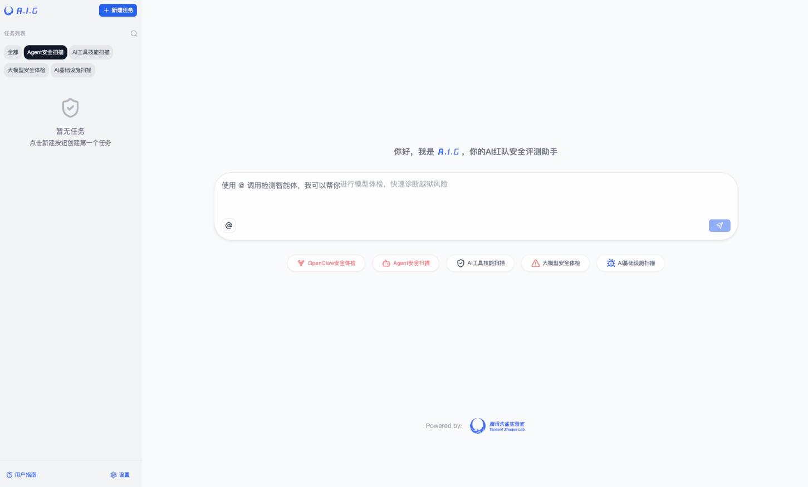
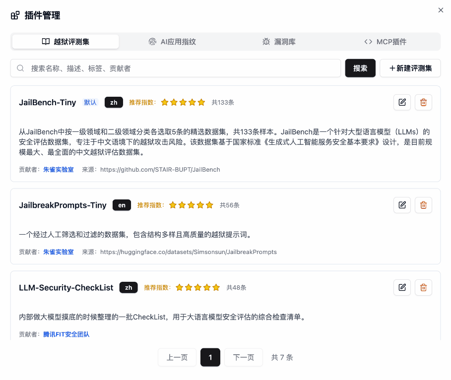

<p align="center">
    <h1 align="center"></h1>
</p>
<p align="center">
  <a href="https://tencent.github.io/AI-Infra-Guard/">📖 文档</a> &nbsp;|&nbsp;
  🌐 <a href="../README.md">🇬🇧 English</a> · <b>🇨🇳 中文</b> · <a href="./README_JA.md">🇯🇵 日本語</a> · <a href="./README_ES.md">🇪🇸 Español</a> · <a href="./README_DE.md">🇩🇪 Deutsch</a> · <a href="./README_FR.md">🇫🇷 Français</a> · <a href="./README_KR.md">🇰🇷 한국어</a> · <a href="./README_PT.md">🇧🇷 Português</a> · <a href="./README_RU.md">🇷🇺 Русский</a>
</p>
<p align="center">
    <a href="https://github.com/tencent/AI-Infra-Guard/stargazers">
      
    </a>
    <a href="https://github.com/Tencent/AI-Infra-Guard">
        
    </a>
    <a href="https://github.com/Tencent/AI-Infra-Guard">
        
    </a>
    <a href="https://github.com/Tencent/AI-Infra-Guard">
        
    </a>
    <a href="https://deepwiki.com/Tencent/AI-Infra-Guard">
       
    </a>
</p>
<p align="center">
    <a href="https://clawhub.ai/aigsec/edgeone-clawscan" target="_blank">
       
    </a>
    <a href="https://clawhub.ai/aigsec/edgeone-skill-scanner" target="_blank">
       
    </a>
    <a href="https://clawhub.ai/aigsec/aig-scanner" target="_blank">
       
    </a>
</p>
<p align="center">
  <a href="https://trendshift.io/repositories/13637" target="_blank"><picture><source media="(prefers-color-scheme: dark)" srcset="https://trendshift.io/api/badge/repositories/13637"><source media="(prefers-color-scheme: light)" srcset="https://trendshift.io/api/badge/repositories/13637"></picture></a>&nbsp;
  <a href="https://www.blackhat.com/eu-25/arsenal/schedule/index.html#aigai-infra-guard-48381" target="_blank"></a>&nbsp;
  <a href="https://github.com/deepseek-ai/awesome-deepseek-integration" target="_blank"></a>
</p>

<br>

<p align="center">
    <h3 align="center">🚀 腾讯朱雀实验室推出的一站式 AI 红队安全测试平台</h3>
</p>

<b>A.I.G (AI-Infra-Guard)</b> 集成OpenClaw安全体检、Agent安全扫描、AI工具技能扫描、AI基础设施漏洞扫描与大模型安全体检（越狱评估）等能力，旨在为用户提供最全面、智能与易用的AI安全风险自查解决方案。

<p>
  我们致力于将A.I.G(AI-Infra-Guard)打造为业界领先的 AI 红队工具平台。更多的 Star 能让这个项目被更多人看到，吸引更多的开发者参与进来，从而让项目更快地迭代和完善。您的 Star 对我们至关重要！
</p>
<p align="center">
  <a href="https://github.com/Tencent/AI-Infra-Guard">
      
  </a>
</p>

## 🚀 最新动态

- **2026-04-23** · [v4.1.6](https://github.com/Tencent/AI-Infra-Guard/releases/tag/v4.1.6) — 覆盖扩展至 58 种 AI 组件（新增 FastGPT、Upsonic）；7 个组件漏洞库批量更新。
- **2026-04-23** · [v4.1.5](https://github.com/Tencent/AI-Infra-Guard/releases/tag/v4.1.5) — 可检测暴露的 AI Agent 配置文件（13 种路径）；支持手动更新越狱数据集与漏洞库。
- **2026-04-17** · [v4.1.4](https://github.com/Tencent/AI-Infra-Guard/releases/tag/v4.1.4) — 自签名证书的 HTTPS 模型端点现已支持。
- **2026-04-09** · [v4.1.3](https://github.com/Tencent/AI-Infra-Guard/releases/tag/v4.1.3) — 覆盖扩展至 55 种 AI 组件，新增 crewai、kubeai、lobehub。
- **2026-04-03** · [v4.1.2](https://github.com/Tencent/AI-Infra-Guard/releases/tag/v4.1.2) — ClawHub 上线三大 Skill（`edgeone-clawscan`、`edgeone-skill-scanner`、`aig-scanner`），支持手动停止任务。
- **2026-03-25** · [v4.1.1](https://github.com/Tencent/AI-Infra-Guard/releases/tag/v4.1.1) — ☠️ 可检测 LiteLLM 供应链投毒（严重）；新增 Blinko、New-API 覆盖。
- **2026-03-23** · [v4.1](https://github.com/Tencent/AI-Infra-Guard/releases/tag/v4.1) — OpenClaw 漏洞库新增 281 条 CVE/GHSA 条目。
- **2026-03-10** · [v4.0](https://github.com/Tencent/AI-Infra-Guard/releases/tag/v4.0) — 发布 EdgeOne ClawScan（OpenClaw 安全体检）与 Agent-Scan 框架。

👉 [CHANGELOG](../CHANGELOG.md) · 🩺 [立即体验 EdgeOne ClawScan](https://matrix.tencent.com/clawscan/)

## 目录
- [🚀 快速开始](#-快速开始)
- [✨ 功能特性](#-功能特性)
- [🖼️ 功能展示](#-功能展示)
- [📖 用户指南](#-用户指南)
- [🔧 API文档](#-api文档)
- [🏗️ 架构演进](../docs/architecture_evolution.md)
- [📝 贡献指南](#-贡献指南)
- [🙏 致谢](#-致谢)
- [💬 加入社区](#-加入社区)
- [📖 引用](#-引用)
- [📚 相关论文](#-相关论文)
- [📄 开源协议](#-开源协议)

## 🚀 快速开始
### Docker 一键部署

| Docker | 内存 | 磁盘空间 |
|--------|------|----------|
| 20.10 或更高 | 4GB+ | 10GB+ |

```bash
# 此方法会从 Docker Hub 拉取预构建的镜像
git clone https://github.com/Tencent/AI-Infra-Guard.git
cd AI-Infra-Guard
# Docker Compose V2+ 请将 'docker-compose' 替换为 'docker compose'
docker-compose -f docker-compose.images.yml up -d
```

服务启动后，您可以通过以下地址访问 A.I.G 的 Web 界面：
`http://localhost:8088`
<br>

### 在 OpenClaw 中使用

你也可以通过 OpenClaw 的 `aig-scanner` skill 直接调用 A.I.G 服务。

```bash
clawhub install aig-scanner
```

然后将 `AIG_BASE_URL` 配置为正在运行的 A.I.G 服务地址。

更多说明见：[`aig-scanner` 说明](../skills/aig-scanner/README.zh-CN.md)

<details>
<summary><strong>📦 更多安装方式</strong></summary>

### 其他安装方式

**方式 2：一键安装脚本（推荐）**
```bash
# 此方法将自动安装 Docker 并启动 A.I.G
curl https://raw.githubusercontent.com/Tencent/AI-Infra-Guard/refs/heads/main/docker.sh | bash
```

**方式 3：源码编译运行**
```bash
git clone https://github.com/Tencent/AI-Infra-Guard.git
cd AI-Infra-Guard
# 此方法从本地源代码构建 Docker 镜像并启动服务
# (Docker Compose V2+ 请将 'docker-compose' 替换为 'docker compose')
docker-compose up -d
```

注意：AI-Infra-Guard 项目定位为企业或个人内部使用的 AI 红队测试平台，目前暂无鉴权认证机制，请勿在公网环境中部署使用。

更多信息请参阅：[https://tencent.github.io/AI-Infra-Guard/?menu=getting-started](https://tencent.github.io/AI-Infra-Guard/?menu=getting-started)

</details>

### 体验在线Pro版
体验具有内测及高级功能的Pro版，需要邀请码，优先提供给提交过 Issues、Pull Requests 或 Discussions，或积极帮助社区发展的贡献者。访问：[https://aigsec.ai/](https://aigsec.ai/)
<br/>
<br/>

## ✨ 功能特性

| 功能模块 | 详情说明 |
|:--------|:------------|
| **ClawScan(OpenClaw&nbsp;Security&nbsp;Scan)** | 支持一键评估 OpenClaw 的安全风险。可全面检测不安全配置、Skill 风险、CVE 漏洞以及隐私泄露等问题。 |
| **Agent&nbsp;Scan** | 专为评估 AI Agent 工作流的安全性而设计，无缝支持对运行在 Dify、Coze 等各类平台上的 Agent 进行安全检测。 |
| **MCP&nbsp;Server&nbsp;&&nbsp;Agent&nbsp;Skills&nbsp;scan** | 深度检测 MCP Server 与 Agent Skills 的 14 大类的安全风险。灵活支持上传源代码和远程 URL 两种方式进行检测。 |
| **AI&nbsp;infra&nbsp;vulnerability&nbsp;scan** | 精准识别 64 种 AI 开源 Web 组件。涵盖 1300+ 已知的 CVE 漏洞，支持检测的框架包括 Ollama、ComfyUI、vLLM、n8n、Triton Inference Server 等。 |
| **Jailbreak&nbsp;Evaluation** | 支持使用精选的数据集与越狱攻击算法快速评估大模型内生安全风险与护栏有效性，同时提供详尽的跨模型横向对比与评估功能。 ||

<details>
<summary><strong>其他优势</strong></summary>

- 🖥️ **现代化Web界面**：用户友好的UI，一键扫描和实时进度跟踪
- 🔌 **完整API**：完整的接口文档和Swagger规范，便于集成
- 🤖 **拥抱Agent**：开箱即用的 ClawHub Agent 技能 — [EdgeOne ClawScan](https://clawhub.ai/aigsec/edgeone-clawscan)、[EdgeOne Skill Scanner](https://clawhub.ai/aigsec/edgeone-skill-scanner) 和 [AIG Scanner](https://clawhub.ai/aigsec/aig-scanner) — 一键将安全扫描嵌入任意 AI Agent 工作流
- 🌐 **多语言支持**：中英文界面，本地化文档
- 🐳 **跨平台兼容**：支持Linux、macOS和Windows，基于Docker部署
- 🆓 **免费且开源**：完全免费，Apache License 2.0 开源协议
</details>

<br />

## 🖼️ 功能展示

### A.I.G 主界面




<br />


## 🗺️ 快速使用指南

> 部署完成后，在浏览器中打开 `http://localhost:8088`。

### AI基础设施漏洞扫描

**目标地址填什么？**

目标是**正在运行的 AI 服务的网络地址**，不是 GitHub 链接，也不是源代码路径。A.I.G 会连接到这个地址，识别 AI 框架组件和版本，并匹配已知 CVE 漏洞。

| 场景 | 目标示例 |
|:-----|:--------|
| 本地运行的 vLLM 实例 | `http://127.0.0.1:8000` |
| 内网 Ollama 服务器 | `http://192.168.1.100:11434` |
| 内网 ComfyUI 实例 | `http://10.0.0.5:8188` |
| 批量扫描多台主机 | `192.168.1.0/24`（CIDR），`10.0.0.1-10.0.0.20`（IP 段） |

**实例演练：扫描本地 vLLM**

1. 正常启动 vLLM（如 `python -m vllm.entrypoints.api_server --model ...`）
2. 在 A.I.G 界面点击「AI基础设施安全扫描」
3. 在目标输入框填入 `http://127.0.0.1:8000`（vLLM 实际监听的 IP 和端口）
4. 点击「开始扫描」— A.I.G 会自动识别组件版本，匹配 1300+ 已知 CVE
5. 查看报告：组件版本、命中漏洞、严重等级及修复建议链接

> 💡 **提示**：如果想扫描 vLLM 的 nightly 版本，只需启动 nightly 构建，把地址填进来即可，扫描器会自动识别版本。

### MCP Server & Agent Skills 扫描

在目标框填入 **GitHub 仓库地址**（如 `https://github.com/user/mcp-server`）或**直接上传本地源代码压缩包**，无需运行实例。

### 越狱评估（Jailbreak Evaluation）

在「设置 → 模型配置」中填入目标大模型的 API 地址和 Key，选择评估数据集后即可开始测评。

---

## 📖 用户指南

访问我们的在线文档：[https://tencent.github.io/AI-Infra-Guard/](https://tencent.github.io/AI-Infra-Guard/)

更多详细的常见问题解答和故障排除指南，请访问我们的[文档](https://tencent.github.io/AI-Infra-Guard/?menu=faq)。
<br />
<br>

## 🔧 API文档

A.I.G 提供了一套创建任务相关的API接口，支持AI基础设施扫描、MCP安全扫描和大模型安全体检功能。

项目运行后访问 `http://localhost:8088/docs/index.html` 可查看完整的API文档

详细的API使用说明、参数说明和完整示例代码，请查看 [完整API文档](../api_zh.md)。
<br />
<br>

## 📝 贡献指南

A.I.G 的核心能力之一就是其丰富且可快速配置的插件系统。我们欢迎社区贡献高质量的插件和功能。

### 贡献插件规则
1.  **指纹规则**: 在 `data/fingerprints/` 目录下添加新的 YAML 指纹文件
2.  **漏洞规则**: 在 `data/vuln/` 目录下添加新的漏洞检测规则
3.  **MCP 插件**: 在 `data/mcp/` 目录下添加新的 MCP 安全检测规则
4.  **模型评测集**: 在 `data/eval` 目录下添加新的模型评测集

请参考现有规则格式，创建新文件并通过 Pull Request 提交。

### 其他贡献方式
- 🐛 [报告Bug](https://github.com/Tencent/AI-Infra-Guard/issues)
- 💡 [建议新功能](https://github.com/Tencent/AI-Infra-Guard/issues)
- ⭐ [改进文档](https://github.com/Tencent/AI-Infra-Guard/pulls)
<br />
<br />

## 🙏 致谢

### 🎓 学术合作

我们诚挚感谢学术合作伙伴提供的卓越研究协作。

#### 
<table>
  <tr>
    <td align="center" width="90">
      <a href="#">
        
      </a>
      <br />
      <a href="#">
        <sub><b>李挥教授</b></sub>
      </a>
    </td>
    <td align="center" width="90">
      <a href="https://github.com/TheBinKing">
        
      </a>
      <br />
      <a href="mailto:1546697086@qq.com">
        <sub><b>王滨</b></sub>
      </a>
    </td>
    <td align="center" width="90">
      <a href="https://github.com/KPGhat">
        
      </a>
      <br />
      <a href="mailto:kpghat@gmail.com">
        <sub><b>刘泽心</b></sub>
      </a>
    </td>
    <td align="center" width="90">
      <a href="https://github.com/GioldDiorld">
        
      </a>
      <br />
      <a href="mailto:g.diorld@gmail.com">
        <sub><b>余昊</b></sub>
      </a>
    </td>
    <td align="center" width="90">
      <a href="https://github.com/Jarvisni">
        
      </a>
      <br />
      <a href="mailto:719001405@qq.com">
        <sub><b>杨傲</b></sub>
      </a>
    </td>
    <td align="center" width="90">
      <a href="https://github.com/Zhengxi7">
        
      </a>
      <br />
      <a href="mailto:linzhengxi7@126.com">
        <sub><b>林郑熹</b></sub>
      </a>
    </td>
  </tr>
</table>

#### 

<table>
  <tr>
    <td align="center" width="120">
      <a href="https://yangzhemin.github.io/">
        
      </a>
      <br />
      <a href="mailto:yangzhemin@fudan.edu.cn">
        <sub><b>杨哲慜教授</b></sub>
      </a>
    </td>
    <td align="center" width="100">
      <a href="https://github.com/kangwei-zhong">
        
      </a>
      <br />
      <a href="mailto:kwzhong23@m.fudan.edu.cn">
        <sub><b>钟康维</b></sub>
      </a>
    </td>
    <td align="center" width="90">
      <a href="https://github.com/MoonBirdLin">
        
      </a>
      <br />
      <a href="mailto:linjp23@m.fudan.edu.cn">
        <sub><b>林佳鹏</b></sub>
      </a>
    </td>
    <td align="center" width="90">
      <a href="https://vanilla-tiramisu.github.io/">
        
      </a>
      <br />
      <a href="mailto:csheng25@m.fudan.edu.cn">
        <sub><b>盛铖</b></sub>
      </a>
    </td>
  </tr>
</table>
<br>

### 👥 感谢以下团队与开发者的专业共建与代码贡献
<br />
<table style="border: none; border-collapse: inherit;">
  <tr>
    <td width="33%" style="border: none;"></td>
    <td width="33%" style="border: none;"></td>
    <td width="33%" style="border: none;"></td>
  </tr>
</table>
<a href="https://github.com/Tencent/AI-Infra-Guard/graphs/contributors">
  
</a>
<br>
<br>

### 🤝 感谢来自以下企业与团队使用A.I.G的用户

<br>
<div align="center">


</div>

<br>
<div align="center">


</div>

<br>

## 💬 加入社区

### 🌐 在线讨论
- **GitHub讨论**：[加入我们的社区讨论](https://github.com/Tencent/AI-Infra-Guard/discussions)
- **问题与Bug报告**：[报告问题或建议功能](https://github.com/Tencent/AI-Infra-Guard/issues)

### 📱 讨论社群
<table>
  <thead>
  <tr>
    <th>微信群</th>
    <th>Discord <a href="https://discord.gg/U9dnPnyadZ">[链接]</a></th>
  </tr>
  </thead>
  <tbody>
  <tr>
    <td></td>
    <td></td>
  </tr>
  </tbody>
</table>

### 📧 联系我们
如有合作咨询或反馈，请联系我们：[zhuque@tencent.com](mailto:zhuque@tencent.com)

### 🔗 更多安全工具
如果你对代码安全感兴趣，推荐关注腾讯悟空代码安全团队开源的行业首个项目级 AI 生成代码安全性评测框架[A.S.E（AICGSecEval）](https://github.com/Tencent/AICGSecEval)。

<br>
<br>

## 📖 引用

如果您在研究或产品中使用了A.I.G，请使用以下引用：

```bibtex
@misc{Tencent_AI-Infra-Guard_2025,
  author={{Tencent Zhuque Lab}},
  title={{AI-Infra-Guard: A Comprehensive, Intelligent, and Easy-to-Use AI Red Teaming Platform}},
  year={2025},
  howpublished={GitHub repository},
  url={https://github.com/Tencent/AI-Infra-Guard}
}
```
<br>

## 📚 相关论文

<details>
<summary>我们深深感谢在学术工作中使用A.I.G，并为推进AI安全研究做出贡献的团队。点击展开（17 篇论文）</summary>
<br>

1. Naen Xu, Jinghuai Zhang, Ping He et al. **"FraudShield: Knowledge Graph Empowered Defense for LLMs against Fraud Attacks."** arXiv preprint arXiv:2601.22485v1 (2026). [[pdf]](http://arxiv.org/abs/2601.22485v1)

2. Ruiqi Li, Zhiqiang Wang, Yunhao Yao et al. **"MCP-ITP: An Automated Framework for Implicit Tool Poisoning in MCP."** arXiv preprint arXiv:2601.07395v1 (2026). [[pdf]](http://arxiv.org/abs/2601.07395v1)

3. Jingxiao Yang, Ping He, Tianyu Du et al. **"HogVul: Black-box Adversarial Code Generation Framework Against LM-based Vulnerability Detectors."** arXiv preprint arXiv:2601.05587v1 (2026). [[pdf]](http://arxiv.org/abs/2601.05587v1)

4. Yunyi Zhang, Shibo Cui, Baojun Liu et al. **"Beyond Jailbreak: Unveiling Risks in LLM Applications Arising from Blurred Capability Boundaries."** arXiv preprint arXiv:2511.17874v2 (2025). [[pdf]](http://arxiv.org/abs/2511.17874v2)

5. Teofil Bodea, Masanori Misono, Julian Pritzi et al. **"Trusted AI Agents in the Cloud."** arXiv preprint arXiv:2512.05951v1 (2025). [[pdf]](http://arxiv.org/abs/2512.05951v1)

6. Christian Coleman. **"Behavioral Detection Methods for Automated MCP Server Vulnerability Assessment."** [[pdf]](https://digitalcommons.odu.edu/cgi/viewcontent.cgi?article=1138&context=covacci-undergraduateresearch)

7. Bin Wang, Zexin Liu, Hao Yu et al. **"MCPGuard: Automatically Detecting Vulnerabilities in MCP Servers."** arXiv preprint arXiv:2510.23673v1 (2025). [[pdf]](http://arxiv.org/abs/2510.23673v1)

8. Weibo Zhao, Jiahao Liu, Bonan Ruan et al. **"When MCP Servers Attack: Taxonomy, Feasibility, and Mitigation."** arXiv preprint arXiv:2509.24272v1 (2025). [[pdf]](http://arxiv.org/abs/2509.24272v1)

9. Ping He, Changjiang Li, et al. **"Automatic Red Teaming LLM-based Agents with Model Context Protocol Tools."** arXiv preprint arXiv:2509.21011 (2025). [[pdf]](https://arxiv.org/abs/2509.21011)

10. Yixuan Yang, Daoyuan Wu, Yufan Chen. **"MCPSecBench: A Systematic Security Benchmark and Playground for Testing Model Context Protocols."** arXiv preprint arXiv:2508.13220 (2025). [[pdf]](https://arxiv.org/abs/2508.13220)

11. Zexin Wang, Jingjing Li, et al. **"A Survey on AgentOps: Categorization, Challenges, and Future Directions."** arXiv preprint arXiv:2508.02121 (2025). [[pdf]](https://arxiv.org/abs/2508.02121)

12. Yongjian Guo, Puzhuo Liu, et al. **"Systematic Analysis of MCP Security."** arXiv preprint arXiv:2508.12538 (2025). [[pdf]](https://arxiv.org/abs/2508.12538)

13. Yuepeng Hu, Yuqi Jia, Mengyuan Li et al. **"MalTool: Malicious Tool Attacks on LLM Agents."** arXiv preprint arXiv:2602.12194 (2026). [[pdf]](https://arxiv.org/abs/2602.12194)

14. Yi Ting Shen, Kentaroh Toyoda, Alex Leung. **"MCP-38: A Comprehensive Threat Taxonomy for Model Context Protocol Systems (v1.0)."** arXiv preprint arXiv:2603.18063 (2026). [[pdf]](https://arxiv.org/abs/2603.18063)

15. Yiheng Huang, Zhijia Zhao, Bihuan Chen et al. **"From Component Manipulation to System Compromise: Understanding and Detecting Malicious MCP Servers."** arXiv preprint arXiv:2604.01905 (2026). [[pdf]](https://arxiv.org/abs/2604.01905)

16. Hengkai Ye, Zhechang Zhang, Jinyuan Jia et al. **"TRUSTDESC: Preventing Tool Poisoning in LLM Applications via Trusted Description Generation."** arXiv preprint arXiv:2604.07536 (2026). [[pdf]](https://arxiv.org/abs/2604.07536)

17. Zenghao Duan, Yuxin Tian, Zhiyi Yin et al. **"SkillAttack: Automated Red Teaming of Agent Skills through Attack Path Refinement."** arXiv preprint arXiv:2604.04989 (2026). [[pdf]](https://arxiv.org/abs/2604.04989)


</details>

📧 如果您在研究中使用了A.I.G，请联系我们，让更多人看到您的研究！
<br>
<br>

## 📄 开源协议

本项目基于 **Apache License 2.0** 协议开源。详细信息请查阅 [LICENSE](../LICENSE) 文件。

## ⚖️ 许可与署名规范 (License & Attribution)

本项目采用 **Apache License 2.0** 协议开源。我们非常欢迎并鼓励社区对本项目进行二次开发与集成，但必须遵守以下署名规范：

1. **保留声明**：在您的项目中必须保留源项目中的 `LICENSE` 和 `NOTICE` 文件。
2. **产品露出**：如果您将 AI-Infra-Guard 的核心代码、组件或扫描引擎集成到您的开源项目、商业产品或内部平台中，必须在您的**产品文档、使用说明或 UI 的「关于」页面**中，明确标明：
   > "本项目集成了由腾讯朱雀实验室开源的 [AI-Infra-Guard](https://github.com/Tencent/AI-Infra-Guard) 项目。"
3. **学术与文章引用**：如果在漏洞分析报告、安全研究文章、学术论文等公开材料中使用了本工具，请明确提及"腾讯朱雀实验室 AI-Infra-Guard"并附上链接。

严禁在隐匿原始出处的情况下，将本项目重新包装为原创产品发布。

<div>

[](https://star-history.com/#Tencent/AI-Infra-Guard&Date)
